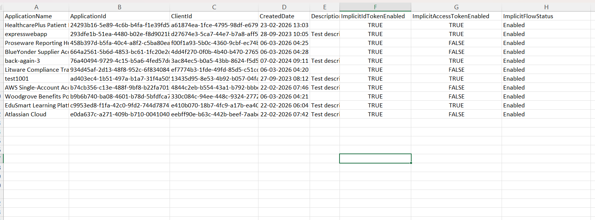

<html>

<h1>Find Entra Apps with Implicit Flow Enabled</h1>

This script helps administrators identify Microsoft Entra applications that have <b>Implicit Flow</b> enabled using Microsoft Graph PowerShell.

<h2>📌 Overview</h2>

Implicit Flow is an older authentication mechanism primarily used in legacy or browser-based applications. Enabling it can introduce security risks if not properly managed.

This script enables you to:

<ul>
<li>Identify applications with implicit flow enabled</li>
<li>Detect legacy authentication configurations</li>
<li>Improve security posture by reviewing outdated auth flows</li>
</ul>

<h2>🚀 Features</h2>

<ul>
<li>Scans all Entra applications</li>
<li>Checks implicit ID token issuance setting</li>
<li>Checks implicit access token issuance setting</li>
<li>Identifies apps using implicit authentication flow</li>
<li>Exports results to CSV for analysis</li>
</ul>

<h2>🛠 Prerequisites</h2>

<ul>
<li>Microsoft Graph PowerShell module</li>
<li>Required permission:
    <ul>
        <li><code>Application.Read.All</code></li>
    </ul>
</li>
</ul>

Connect using:

<pre>
Connect-MgGraph -Scopes "Application.Read.All"
</pre>

<h2>📂 Files Included</h2>

<ul>
<li><code>find-entra-apps-with-implicit-flow.ps1</code> — PowerShell script</li>
<li><code>README.md</code> — Script overview and usage notes</li>
<li><code>demo.png</code> — Sample output image</li>
</ul>

<h2>📊 Sample Output</h2>

Below is a sample output of the script execution:

<em>📌 The image above is sourced from the original M365Corner article.</em>

<h2>🎯 Use Cases</h2>

<ul>
<li>Identify legacy authentication configurations</li>
<li>Audit applications using implicit flow</li>
<li>Support migration to modern authentication (Auth Code + PKCE)</li>
<li>Strengthen application security posture</li>
</ul>

<h2>⚠️ Security Consideration</h2>

Implicit Flow is generally <b>not recommended</b> for modern applications due to security limitations.

<ul>
<li>Consider disabling implicit flow where not required</li>
<li>Prefer Authorization Code Flow with PKCE for modern apps</li>
</ul>

<h2>⚠️ Notes</h2>

<ul>
<li>The script checks both ID token and access token implicit settings</li>
<li>Some legacy apps may still rely on implicit flow</li>
<li>Review applications carefully before making changes</li>
</ul>

<h2>🌐 Detailed Guide</h2>

For full script, explanation, and enhancements:  
View Detailed Article on M365Corner👉 https://m365corner.com/m365-powershell/find-entra-apps-with-implicit-flow-using-powershell.html
</a>

<h2>⭐ Support</h2>

If you find this useful:

<ul>
<li>Star ⭐ the repository</li>
<li>Share with fellow administrators</li>
</ul>

<h2>📌 About M365Corner</h2>

M365Corner provides practical Microsoft 365 PowerShell scripts and admin guides to simplify day-to-day operations.

👉 <a href="https://m365corner.com" target="_blank">https://m365corner.com</a>

</html>
