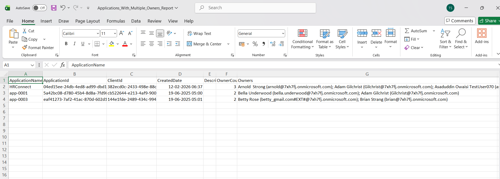

<html>

<h1>Find Entra Apps with Multiple Owners</h1>

This script helps administrators identify Microsoft Entra applications that have multiple assigned owners using Microsoft Graph PowerShell.

<h2>📌 Overview</h2>

Applications with multiple owners can improve resilience, but excessive ownership may lead to governance and accountability challenges.

This script enables you to:

<ul>
<li>Identify applications with multiple owners</li>
<li>Review ownership distribution</li>
<li>Improve governance and accountability</li>
</ul>

<h2>🚀 Features</h2>

<ul>
<li>Scans all Entra applications</li>
<li>Identifies apps with more than one owner</li>
<li>Displays owner count and details</li>
<li>Exports results to CSV for reporting</li>
</ul>

<h2>🛠 Prerequisites</h2>

<ul>
<li>Microsoft Graph PowerShell module</li>
<li>Required permissions:
    <ul>
        <li><code>Application.Read.All</code></li>
        <li><code>Directory.Read.All</code></li>
    </ul>
</li>
</ul>

Connect using:

<pre>
Connect-MgGraph -Scopes "Application.Read.All","Directory.Read.All"
</pre>

<h2>📂 Files Included</h2>

<ul>
<li><code>find-entra-apps-with-multiple-owners.ps1</code> — PowerShell script</li>
<li><code>README.md</code> — Script overview and usage notes</li>
<li><code>demo.png</code> — Sample output image</li>
</ul>

<h2>📊 Sample Output</h2>

Below is a sample output of the script execution:

<em>📌 The image above is sourced from the original M365Corner article.</em>

<h2>🎯 Use Cases</h2>

<ul>
<li>Review application ownership distribution</li>
<li>Ensure proper accountability for critical apps</li>
<li>Identify apps with excessive ownership</li>
<li>Improve governance and ownership policies</li>
</ul>

<h2>⚠️ Notes</h2>

<ul>
<li>Multiple owners can improve availability but may dilute accountability</li>
<li>Review ownership assignments based on organizational policies</li>
<li>Useful for periodic governance audits</li>
</ul>

<h2>⭐ Support</h2>

If you find this useful:

<ul>
<li>Star ⭐ the repository</li>
<li>Share with fellow administrators</li>
</ul>

<h2>📌 About M365Corner</h2>

M365Corner provides practical Microsoft 365 PowerShell scripts and admin guides to simplify day-to-day operations.

👉 <a href="https://m365corner.com" target="_blank">https://m365corner.com</a>

</html>
