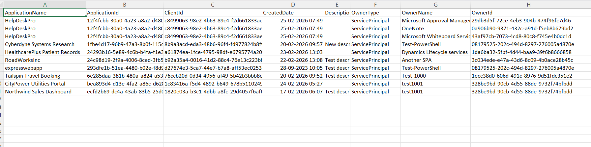

<html>

<h1>Find Entra Apps with Service Principal Owners</h1>

This script helps administrators identify Microsoft Entra applications that have <b>Service Principal</b> owners using Microsoft Graph PowerShell.

<h2>📌 Overview</h2>

Applications owned by Service Principals can be harder to track and govern than apps owned by individual users. Reviewing these ownership patterns is important for accountability, security, and operational transparency.

This script enables you to:

<ul>
<li>Identify apps that are owned by Service Principals</li>
<li>Differentiate non-human ownership from user ownership</li>
<li>Review ownership models for governance and audit purposes</li>
</ul>

<h2>🚀 Features</h2>

<ul>
<li>Scans all Entra applications</li>
<li>Retrieves application owners</li>
<li>Filters only Service Principal owners</li>
<li>Ignores user owners automatically</li>
<li>Exports results to CSV for reporting and review</li>
</ul>

<h2>🛠 Prerequisites</h2>

<ul>
<li>Microsoft Graph PowerShell module</li>
<li>Required permissions:
    <ul>
        <li><code>Application.Read.All</code></li>
        <li><code>Directory.Read.All</code></li>
    </ul>
</li>
</ul>

Connect using:

<pre>
Connect-MgGraph -Scopes "Application.Read.All","Directory.Read.All"
</pre>

<h2>📂 Files Included</h2>

<ul>
<li><code>find-entra-apps-with-service-principal-owners.ps1</code> — PowerShell script</li>
<li><code>README.md</code> — Script overview and usage notes</li>
<li><code>demo.png</code> — Sample output image</li>
</ul>

<h2>📊 Sample Output</h2>

Below is a sample output of the script execution:

<em>📌 The image above is sourced from the original M365Corner article.</em>

<h2>🎯 Use Cases</h2>

<ul>
<li>Audit non-human ownership of Entra applications</li>
<li>Identify apps governed by Service Principals instead of users</li>
<li>Review accountability gaps in application ownership</li>
<li>Strengthen Entra application governance</li>
</ul>

<h2>🌐 Detailed Guide</h2>

For full script, explanation, and enhancements:  
View Detailed Article on M365Corner👉 https://m365corner.com/m365-powershell/find-entra-apps-with-service-principal-owners-using-powershell.html
</a>

<h2>⚠️ Notes</h2>

<ul>
<li>The script first attempts to resolve owners as users and skips them</li>
<li>Only owners resolvable as Service Principals are included in the report</li>
<li>Useful for periodic ownership and governance reviews</li>
</ul>

<h2>⭐ Support</h2>

If you find this useful:

<ul>
<li>Star ⭐ the repository</li>
<li>Share with fellow administrators</li>
</ul>

<h2>📌 About M365Corner</h2>

M365Corner provides practical Microsoft 365 PowerShell scripts and admin guides to simplify day-to-day operations.

👉 <a href="https://m365corner.com" target="_blank">https://m365corner.com</a>

</html>
