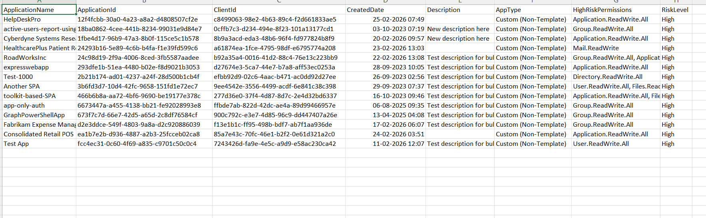

<html>

<h1>List Custom Entra Apps with High-Risk Permissions</h1>

This script helps administrators identify custom (non-template) Microsoft Entra applications that have high-risk API permissions using Microsoft Graph PowerShell.

<h2>📌 Overview</h2>

Custom applications with high-risk permissions can pose serious security threats if not monitored properly.

This script enables you to:

<ul>
<li>Identify custom Entra apps with elevated permissions</li>
<li>Detect potential security risks</li>
<li>Audit permission usage across custom applications</li>
</ul>

<h2>🚀 Features</h2>

<ul>
<li>Filters only custom (non-template) applications</li>
<li>Detects high-risk API permissions</li>
<li>Maps permission IDs to readable permission names</li>
<li>Exports results to CSV for analysis</li>
<li>Highlights high-risk apps in console output</li>
</ul>

<h2>🛠 Prerequisites</h2>

<ul>
<li>Microsoft Graph PowerShell module</li>
<li>Required permission:
    <ul>
        <li><code>Application.Read.All</code></li>
    </ul>
</li>
</ul>

Connect using:

<pre>
Connect-MgGraph -Scopes "Application.Read.All"
</pre>

<h2>📂 Files Included</h2>

<ul>
<li><code>list-custom-entra-apps-with-high-risk-permissions.ps1</code> — PowerShell script</li>
<li><code>README.md</code> — Script overview and usage notes</li>
<li><code>demo.png</code> — Sample output image</li>
</ul>

<h2>📊 Sample Output</h2>

Below is a sample output of the script execution:

<em>📌 The image above is sourced from the original M365Corner article.</em>

<h2>🎯 Use Cases</h2>

<ul>
<li>Identify high-risk custom applications</li>
<li>Audit permission usage across Entra apps</li>
<li>Detect potential security vulnerabilities</li>
<li>Strengthen Zero Trust security posture</li>
</ul>

<h2>⚠️ Notes</h2>

<ul>
<li>The script evaluates permissions against a predefined high-risk list</li>
<li>Permission resolution requires querying service principals</li>
<li>Review results carefully before taking action</li>
<li>Consider periodic audits for better governance</li>
</ul>

<h2>⭐ Support</h2>

If you find this useful:

<ul>
<li>Star ⭐ the repository</li>
<li>Share with fellow administrators</li>
</ul>

<h2>📌 About M365Corner</h2>

M365Corner provides practical Microsoft 365 PowerShell scripts and admin guides to simplify day-to-day operations.

👉 <a href="https://m365corner.com" target="_blank">https://m365corner.com</a>

</html>
