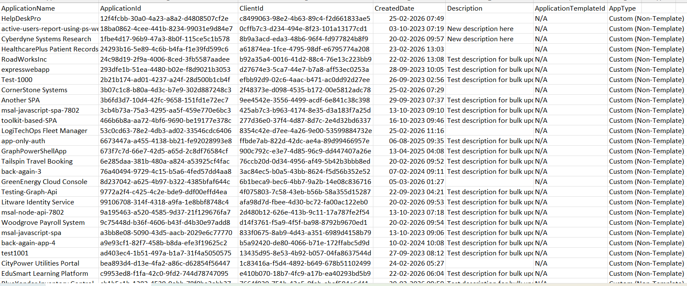

<html>

<h1>List Custom Entra Apps</h1>

This script helps administrators identify custom (non-template) Microsoft Entra applications using Microsoft Graph PowerShell.

<h2>📌 Overview</h2>

Custom Entra applications are typically created manually by developers or administrators and are not based on predefined templates.

This script enables you to:

<ul>
<li>Identify custom (non-template) applications</li>
<li>Differentiate between template-based and custom apps</li>
<li>Export results for audit and reporting</li>
</ul>

<h2>🚀 Features</h2>

<ul>
<li>Filters applications where <code>ApplicationTemplateId</code> is not present</li>
<li>Identifies custom app registrations</li>
<li>Exports results to CSV for further analysis</li>
<li>Displays minimal console output during execution</li>
</ul>

<h2>🛠 Prerequisites</h2>

<ul>
<li>Microsoft Graph PowerShell module</li>
<li>Required permission:
    <ul>
        <li><code>Application.Read.All</code></li>
    </ul>
</li>
</ul>

Connect using:

<pre>
Connect-MgGraph -Scopes "Application.Read.All"
</pre>

<h2>📂 Files Included</h2>

<ul>
<li><code>list-custom-entra-apps.ps1</code> — PowerShell script</li>
<li><code>README.md</code> — Script overview and usage notes</li>
<li><code>demo.png</code> — Sample output image</li>
</ul>

<h2>📊 Sample Output</h2>

Below is a sample output of the script execution:

<em>📌 The image above is sourced from the original M365Corner article.</em>

<h2>🎯 Use Cases</h2>

<ul>
<li>Inventory custom Entra applications</li>
<li>Identify developer-created app registrations</li>
<li>Audit non-template apps for governance and security</li>
<li>Differentiate between standard and custom application deployments</li>
</ul>

<h2>🌐 Detailed Guide</h2>

For full script, explanation, and enhancements:  
View Detailed Article on M365Corner👉 https://m365corner.com/m365-powershell/list-custom-entra-apps-using-powershell.html
</a>

<h2>⚠️ Notes</h2>

<ul>
<li>The script identifies custom apps by checking for absence of <code>ApplicationTemplateId</code></li>
<li>Ensure export path is updated based on your environment</li>
<li>Useful for governance and application inventory reviews</li>
</ul>

<h2>⭐ Support</h2>

If you find this useful:

<ul>
<li>Star ⭐ the repository</li>
<li>Share with fellow administrators</li>
</ul>

<h2>📌 About M365Corner</h2>

M365Corner provides practical Microsoft 365 PowerShell scripts and admin guides to simplify day-to-day operations.

👉 <a href="https://m365corner.com" target="_blank">https://m365corner.com</a>

</html>
