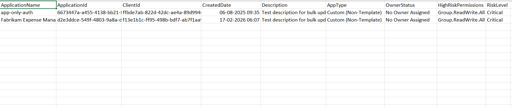

<html>

<h1>List Custom Entra High-Risk Apps with No Owners</h1>

This script helps administrators identify <b>custom (non-template) Microsoft Entra applications</b> that have <b>high-risk API permissions</b> and <b>no assigned owners</b> using Microsoft Graph PowerShell.

<h2>📌 Overview</h2>

Applications that combine <b>high-risk permissions</b> with <b>no ownership</b> represent one of the most critical security risks in an Entra environment.

This script enables you to:

<ul>
<li>Identify high-risk custom applications with no accountability</li>
<li>Detect potential security vulnerabilities</li>
<li>Prioritize remediation of critical app risks</li>
</ul>

<h2>🚀 Features</h2>

<ul>
<li>Filters only custom (non-template) applications</li>
<li>Identifies apps with no assigned owners</li>
<li>Detects high-risk API permissions</li>
<li>Maps permission IDs to readable permission names</li>
<li>Exports results to CSV for reporting</li>
<li>Highlights critical apps in console output</li>
</ul>

<h2>🛠 Prerequisites</h2>

<ul>
<li>Microsoft Graph PowerShell module</li>
<li>Required permissions:
    <ul>
        <li><code>Application.Read.All</code></li>
        <li><code>Directory.Read.All</code></li>
    </ul>
</li>
</ul>

Connect using:

<pre>
Connect-MgGraph -Scopes "Application.Read.All","Directory.Read.All"
</pre>

<h2>📂 Files Included</h2>

<ul>
<li><code>list-custom-entra-high-risk-apps-with-no-owners.ps1</code> — PowerShell script</li>
<li><code>README.md</code> — Script overview and usage notes</li>
<li><code>demo.png</code> — Sample output image</li>
</ul>

<h2>📊 Sample Output</h2>

Below is a sample output of the script execution:

<h2>🎯 Use Cases</h2>

<ul>
<li>Identify critical-risk Entra applications</li>
<li>Detect orphaned apps with elevated permissions</li>
<li>Prioritize remediation of high-risk scenarios</li>
<li>Strengthen Zero Trust security posture</li>
<li>Support security audits and incident investigations</li>
</ul>

<h2>⚠️ Risk Classification</h2>

Applications identified by this script are categorized as:

<ul>
<li><b>Custom App</b> → Not governed by templates</li>
<li><b>No Owner</b> → No accountability</li>
<li><b>High-Risk Permissions</b> → Elevated access</li>
</ul>

👉 Combined risk level: <b>Critical</b>

<h2>⚠️ Notes</h2>

<ul>
<li>The script evaluates permissions against a predefined high-risk list</li>
<li>Permission resolution requires querying service principals</li>
<li>Review results carefully before taking action</li>
<li>Immediate remediation is recommended for critical findings</li>
</ul>

<h2>⭐ Support</h2>

If you find this useful:

<ul>
<li>Star ⭐ the repository</li>
<li>Share with fellow administrators</li>
</ul>

<h2>📌 About M365Corner</h2>

M365Corner provides practical Microsoft 365 PowerShell scripts and admin guides to simplify day-to-day operations.

👉 <a href="https://m365corner.com" target="_blank">https://m365corner.com</a>

</html>
