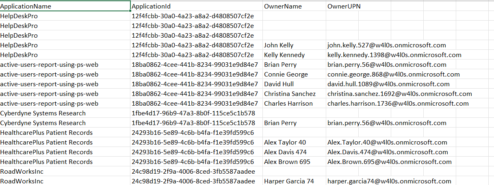

<h1>List Entra App Owners using Graph PowerShell</h1>

This script retrieves all Microsoft Entra applications along with their assigned owners using Microsoft Graph PowerShell.

\---

\## 📌 <h2>Overview</h2>

Managing application ownership is critical for maintaining security and accountability in Microsoft Entra ID.

This script helps administrators:

\- Identify application owners

\- Detect orphaned applications (apps without owners)

\- Improve governance and audit readiness

\---

\## 🚀  <h2>Features </h2>

\- Retrieves all Entra applications

\- Fetches assigned owners for each application

\- Displays owner details (Display Name, UPN)

\- Helps identify ownership gaps

\---

\## 🛠  <h2>Prerequisites </h2>

\- Microsoft Graph PowerShell module installed  

\- Required permissions:

 - Application.Read.All

 - Directory.Read.All

Connect using powershell:

Connect-MgGraph -Scopes "Application.Read.All","Directory.Read.All"

\## <h2>📊 Sample Output</h2>

\---

\## 🎯 <h2>Use Cases</h2>

\- Audit application ownership

\- Identify orphaned Entra applications

\- Strengthen security governance

\- Support compliance requirements

\---

\## 🌐 <h2>Detailed Guide</h2>

For a complete walkthrough, explanation, and enhancements:

👉 https://m365corner.com/m365-powershell/list-entra-id-application-owners-using-graph-powershell.html

\---

\## <h2>⚠️ Notes</h2>

\- Ensure proper permissions before running the script

\- Large environments may take time to process

\- Consider exporting results for reporting

\---

\## <h2>🤝 Contributing</h2>

Suggestions and improvements are welcome as this repository evolves.

\---

\## <h2>⭐ Support</h2>

If you find this useful:

\- Star ⭐ the repository  

\- Share with fellow administrators  

\---

\## 📌 <h2>About M365Corner</h2>

M365Corner provides practical Microsoft 365 PowerShell scripts and admin guides to simplify day-to-day operations.

👉 https://m365corner.com

