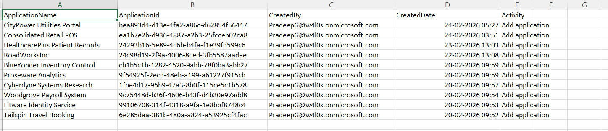

<h1>List Entra Apps Created by a Specific User</h1>

This script helps administrators identify all Microsoft Entra applications created by a specific user using Microsoft Graph PowerShell.

\---

\## 📌 <h2>Overview</h2>

Tracking application ownership and origin is essential for maintaining control over your Entra environment.

This script enables you to:

\- Identify apps created by a specific user

\- Investigate suspicious or unauthorized app registrations

\- Support audit and compliance scenarios

\---

\## 🚀 <h2>Features</h2>

\- Filters Entra applications by creator

\- Helps track user-based app creation activity

\- Useful for security investigations and audits

\---

\## 🛠 <h2>Prerequisites</h2>

\- Microsoft Graph PowerShell module  

\- Required permissions:

  - Application.Read.All`

  - Directory.Read.All`

Connect using:

Connect-MgGraph -Scopes "Application.Read.All","Directory.Read.All"

\---

📊 <h2>Sample Output</h2>

Below is a sample output of the script execution:

> 📌 The image above is sourced from the original M365Corner article.

\---

\## 🎯  <h2>Use Cases </h2>

\- Identify applications created by a specific user

\- Audit developer or admin activity

\- Detect shadow IT or unauthorized app registrations

\- Strengthen governance and compliance

\---

\## 🌐  <h2>Detailed Guide </h2>

For full script, explanation, and enhancements:

👉 https://m365corner.com/m365-powershell/list-entra-apps-created-by-specific-user-using-graph-powershell.html

\---

\## ⚠️  <h2>Notes </h2>

\- Ensure required permissions are granted before execution

\- Results depend on directory size and number of applications

\- Consider exporting results for reporting

\---

\## ⭐  <h2>Support </h2>

If you find this useful:

\- Star ⭐ the repository  

\- Share with fellow administrators  

\---

\## 📌  <h2>About M365Corner </h2>

M365Corner provides practical Microsoft 365 PowerShell scripts and admin guides to simplify day-to-day operations.

👉 https://m365corner.com

