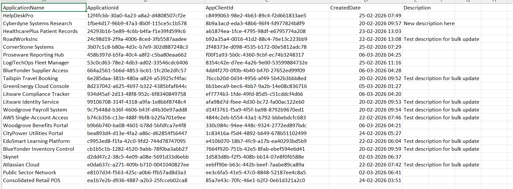

<html>

<h1>List Entra Apps Created in the Last 30 Days</h1>

This script helps administrators identify Microsoft Entra applications that were created in the last 30 days using Microsoft Graph PowerShell.

<h2>📌 Overview</h2>

Monitoring newly created applications is critical for detecting unauthorized or suspicious registrations in your Entra environment.

This script enables you to:

<ul>

<li>Identify recently created Entra applications</li>

<li>Monitor new app registrations</li>

<li>Strengthen security and governance</li>

</ul>

<h2>🚀 Features</h2>

<ul>

<li>Filters applications created within the last 30 days</li>

<li>Helps detect unusual app creation activity</li>

<li>Supports audit and compliance scenarios</li>

</ul>

<h2>🛠 Prerequisites</h2>

<ul>

<li>Microsoft Graph PowerShell module</li>

<li>Required permissions:

&#x20;   <ul>

&#x20;       <li><code>Application.Read.All</code></li>

&#x20;       <li><code>Directory.Read.All</code></li>

&#x20;   </ul>

</li>

</ul>

Connect using:

<pre>

Connect-MgGraph -Scopes "Application.Read.All","Directory.Read.All"

</pre>

<h2>📊 Sample Output</h2>

Below is a sample output of the script execution:

<em>📌 The image above is sourced from the original M365Corner article.</em>

<h2>🎯 Use Cases</h2>

<ul>

<li>Track newly created applications</li>

<li>Identify potential shadow IT activity</li>

<li>Audit app registrations over a time window</li>

<li>Improve governance and monitoring</li>

</ul>

<h2>🌐 Detailed Guide</h2>

For full script, explanation, and enhancements, view the detailed article on M365Corner 👉: https://m365corner.com/m365-powershell/list-entra-apps-created-last-30-days-using-graph-powershell.html

</a>

<h2>⚠️ Notes</h2>

<ul>

<li>Ensure required permissions are granted before execution</li>

<li>Results depend on directory size</li>

<li>Consider exporting results for reporting purposes</li>

</ul>

<h2>⭐ Support</h2>

If you find this useful:

<ul>

<li>Star ⭐ the repository</li>

<li>Share with fellow administrators</li>

</ul>

<h2>📌 About M365Corner</h2>

M365Corner provides practical Microsoft 365 PowerShell scripts and admin guides to simplify day-to-day operations.

👉 <a href="https://m365corner.com" target="\_blank">https://m365corner.com</a>

</html>

