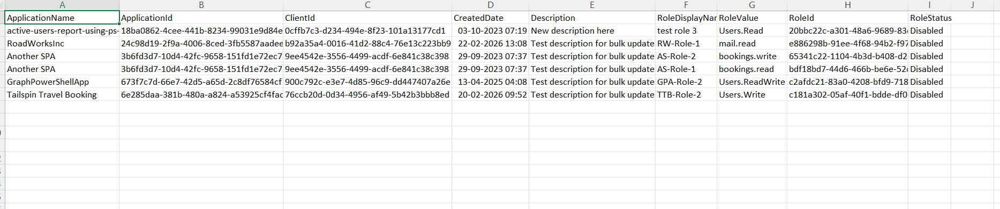

<html>

<h1>List Entra Apps with Disabled Users</h1>

This script helps administrators identify Microsoft Entra applications that are associated with disabled user accounts using Microsoft Graph PowerShell.

<h2>📌 Overview</h2>

Applications linked to disabled user accounts can pose security and governance risks if not reviewed regularly.

This script enables you to:

<ul>

<li>Identify apps owned or associated with disabled users</li>

<li>Detect stale or unmanaged application ownership</li>

<li>Improve security posture and governance</li>

</ul>

<h2>🚀 Features</h2>

<ul>

<li>Detects applications linked to disabled user accounts</li>

<li>Helps identify orphaned or risky app ownership</li>

<li>Supports audit and cleanup activities</li>

</ul>

<h2>🛠 Prerequisites</h2>

<ul>

<li>Microsoft Graph PowerShell module</li>

<li>Required permissions:

&#x20;   <ul>

&#x20;       <li><code>Application.Read.All</code></li>

&#x20;       <li><code>Directory.Read.All</code></li>

&#x20;       <li><code>User.Read.All</code></li>

&#x20;   </ul>

</li>

</ul>

Connect using:

<pre>

Connect-MgGraph -Scopes "Application.Read.All","Directory.Read.All","User.Read.All"

</pre>

<h2>📊 Sample Output</h2>

Below is a sample output of the script execution:

<em>📌 The image above is sourced from the original M365Corner article.</em>

<h2>🎯 Use Cases</h2>

<ul>

<li>Identify applications owned by disabled users</li>

<li>Clean up stale or unmanaged app ownership</li>

<li>Strengthen security and compliance posture</li>

<li>Audit application ownership regularly</li>

</ul>

<h2>🌐 Detailed Guide</h2>

For full script, explanation, and enhancements:

👉 <a href="https://m365corner.com/m365-powershell/list-entra-apps-with-disabled-users-using-graph-powershell.html" target="\_blank">

View Detailed Article on M365Corner

</a>

<h2>⚠️ Notes</h2>

<ul>

<li>Ensure required permissions are granted before execution</li>

<li>Large environments may take time to process</li>

<li>Review results carefully before taking action</li>

</ul>

<h2>⭐ Support</h2>

If you find this useful:

<ul>

<li>Star ⭐ the repository</li>

<li>Share with fellow administrators</li>

</ul>

<h2>📌 About M365Corner</h2>

M365Corner provides practical Microsoft 365 PowerShell scripts and admin guides to simplify day-to-day operations.

👉 <a href="https://m365corner.com" target="\_blank">https://m365corner.com</a>

</html>

