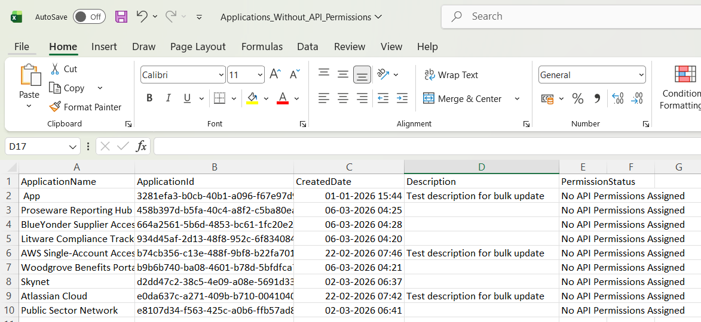

<html>

<h1>List Entra Apps Without API Permissions</h1>

This script helps administrators identify Microsoft Entra applications that do not have any API permissions assigned using Microsoft Graph PowerShell.

<h2>📌 Overview</h2>

Applications without API permissions may indicate unused, incomplete, or test app registrations that require review.

This script enables you to:

<ul>

<li>Identify applications without API permissions</li>

<li>Detect unused or redundant app registrations</li>

<li>Improve governance and cleanup processes</li>

</ul>

<h2>🚀 Features</h2>

<ul>

<li>Scans Entra applications for missing API permissions</li>

<li>Highlights apps with no permission assignments</li>

<li>Supports governance and cleanup activities</li>

</ul>

<h2>🛠 Prerequisites</h2>

<ul>

<li>Microsoft Graph PowerShell module</li>

<li>Required permissions:

&#x20;   <ul>

&#x20;       <li><code>Application.Read.All</code></li>

&#x20;       <li><code>Directory.Read.All</code></li>

&#x20;   </ul>

</li>

</ul>

Connect using:

<pre>

Connect-MgGraph -Scopes "Application.Read.All","Directory.Read.All"

</pre>

<h2>📊 Sample Output</h2>

Below is a sample output of the script execution:

<em>📌 The image above is sourced from the original M365Corner article.</em>

<h2>🎯 Use Cases</h2>

<ul>

<li>Identify unused or incomplete applications</li>

<li>Clean up redundant app registrations</li>

<li>Audit application configurations</li>

<li>Improve Entra governance practices</li>

</ul>

<h2>🌐 Detailed Guide</h2>

For full script, explanation, and enhancements, view the detailed article on M365Corner: 👉  https://m365corner.com/m365-powershell/list-entra-id-applications-without-api-permissions.html

<h2>⚠️ Notes</h2>

<ul>

<li>Ensure required permissions are granted before execution</li>

<li>Review applications before cleanup actions</li>

<li>Useful for periodic governance audits</li>

</ul>

<h2>⭐ Support</h2>

If you find this useful:

<ul>

<li>Star ⭐ the repository</li>

<li>Share with fellow administrators</li>

</ul>

<h2>📌 About M365Corner</h2>

M365Corner provides practical Microsoft 365 PowerShell scripts and admin guides to simplify day-to-day operations.

👉 <a href="https://m365corner.com" target="\_blank">https://m365corner.com</a>

</html>

