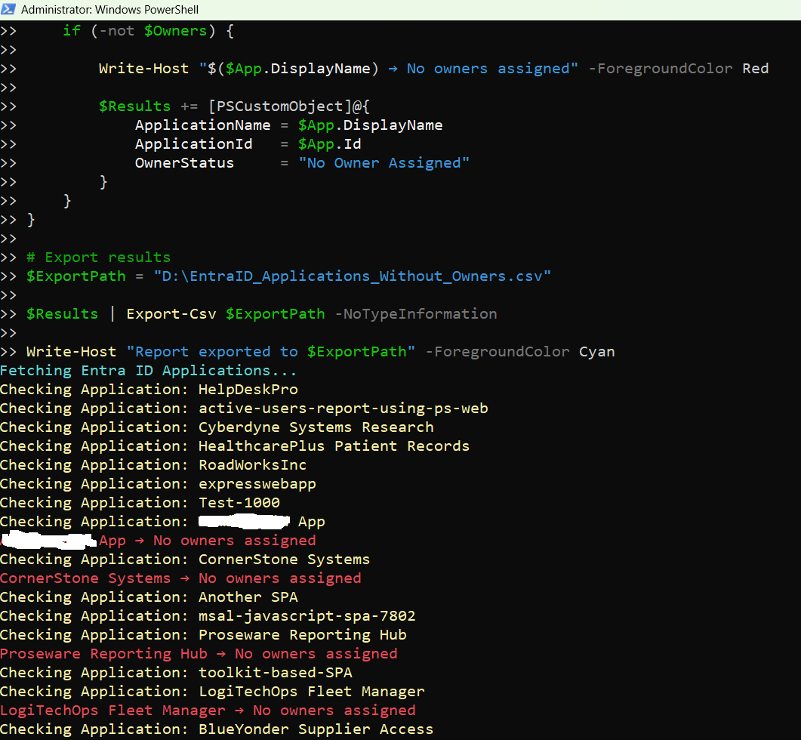

<html>

<h1>List Entra Apps Without Owners</h1>

This script helps administrators identify Microsoft Entra applications that do not have any assigned owners using Microsoft Graph PowerShell.

<h2>📌 Overview</h2>

Applications without owners pose a significant governance and security risk, as there is no accountability for their management.

This script enables you to:

<ul>
<li>Identify orphaned Entra applications</li>
<li>Detect ownership gaps</li>
<li>Improve governance and accountability</li>
</ul>

<h2>🚀 Features</h2>

<ul>
<li>Scans all Entra applications for missing owners</li>
<li>Highlights orphaned applications</li>
<li>Supports audit and governance activities</li>
</ul>

<h2>🛠 Prerequisites</h2>

<ul>
<li>Microsoft Graph PowerShell module</li>
<li>Required permissions:
    <ul>
        <li><code>Application.Read.All</code></li>
        <li><code>Directory.Read.All</code></li>
    </ul>
</li>
</ul>

Connect using:

<pre>
Connect-MgGraph -Scopes "Application.Read.All","Directory.Read.All"
</pre>

<h2>📊 Sample Output</h2>

Below is a sample output of the script execution:

<em>📌 The image above is sourced from the original M365Corner article.</em>

<h2>🎯 Use Cases</h2>

<ul>
<li>Identify orphaned applications</li>
<li>Assign ownership to unmanaged apps</li>
<li>Improve governance and compliance</li>
<li>Reduce security risks associated with unmanaged resources</li>
</ul>

<h2>🌐 Detailed Guide</h2>

For full script, explanation, and enhancements:

👉 <a href="https://m365corner.com/m365-powershell/find-entra-id-applications-without-owners-using-powershell.html" target="_blank">
View Detailed Article on M365Corner
</a>

<h2>⚠️ Notes</h2>

<ul>
<li>Ensure required permissions are granted before execution</li>
<li>Review results before assigning owners</li>
<li>Useful for periodic governance reviews</li>
</ul>

<h2>⭐ Support</h2>

If you find this useful:

<ul>
<li>Star ⭐ the repository</li>
<li>Share with fellow administrators</li>
</ul>

<h2>📌 About M365Corner</h2>

M365Corner provides practical Microsoft 365 PowerShell scripts and admin guides to simplify day-to-day operations.

👉 <a href="https://m365corner.com" target="_blank">https://m365corner.com</a>

</html>
