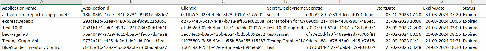

<html>

<h1>List Expiring or Expired Entra App Secrets</h1>

This script helps administrators identify Microsoft Entra applications with expiring or expired client secrets using Microsoft Graph PowerShell.

<h2>📌 Overview</h2>

Expired or soon-to-expire client secrets can cause application failures and potential service disruptions if not monitored proactively.

This script enables you to:

<ul>

<li>Identify expired client secrets</li>

<li>Detect secrets that are nearing expiration</li>

<li>Prevent unexpected application outages</li>

</ul>

<h2>🚀 Features</h2>

<ul>

<li>Detects expired and expiring application secrets</li>

<li>Helps prevent authentication failures</li>

<li>Supports proactive monitoring and maintenance</li>

</ul>

<h2>🛠 Prerequisites</h2>

<ul>

<li>Microsoft Graph PowerShell module</li>

<li>Required permissions:

&#x20;   <ul>

&#x20;       <li><code>Application.Read.All</code></li>

&#x20;       <li><code>Directory.Read.All</code></li>

&#x20;   </ul>

</li>

</ul>

Connect using:

<pre>

Connect-MgGraph -Scopes "Application.Read.All","Directory.Read.All"

</pre>

<h2>📊 Sample Output</h2>

Below is a sample output of the script execution:

<em>📌 The image above is sourced from the original M365Corner article.</em>

<h2>🎯 Use Cases</h2>

<ul>

<li>Monitor expiring application secrets</li>

<li>Prevent service disruptions due to expired credentials</li>

<li>Maintain application authentication health</li>

<li>Support security and compliance audits</li>

</ul>

<h2>🌐 Detailed Guide</h2>

For full script, explanation, and enhancements:

👉 <a href="https://m365corner.com/m365-powershell/list-expiring-or-expired-entra-app-secrets.html" target="\_blank">

View Detailed Article on M365Corner

</a>

<h2>⚠️ Notes</h2>

<ul>

<li>Ensure required permissions are granted before execution</li>

<li>Regular monitoring is recommended to avoid downtime</li>

<li>Consider automating alerts for expiring secrets</li>

</ul>

<h2>⭐ Support</h2>

If you find this useful:

<ul>

<li>Star ⭐ the repository</li>

<li>Share with fellow administrators</li>

</ul>

<h2>📌 About M365Corner</h2>

M365Corner provides practical Microsoft 365 PowerShell scripts and admin guides to simplify day-to-day operations.

👉 <a href="https://m365corner.com" target="\_blank">https://m365corner.com</a>

</html>

