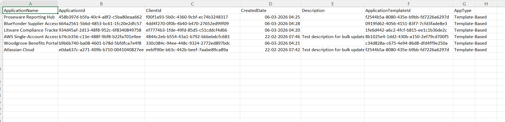

<html>

<h1>List Template Based Entra Apps</h1>

This script helps administrators identify template-based Microsoft Entra applications using Microsoft Graph PowerShell.

<h2>📌 Overview</h2>

Template-based applications are typically created from Microsoft Entra application templates and can be useful to track for governance, inventory, and security review purposes.

This script enables you to:

<ul>

<li>Identify applications created from templates</li>

<li>Capture app, client, and template identifiers</li>

<li>Export findings for audit and reporting</li>

</ul>

<h2>🚀 Features</h2>

<ul>

<li>Scans all Entra applications for <code>ApplicationTemplateId</code></li>

<li>Identifies template-based app registrations</li>

<li>Exports results to CSV for further analysis</li>

<li>Displays minimal console output while processing</li>

</ul>

<h2>🛠 Prerequisites</h2>

<ul>

<li>Microsoft Graph PowerShell module</li>

<li>Required permission:

&#x20;   <ul>

&#x20;       <li><code>Application.Read.All</code></li>

&#x20;   </ul>

</li>

</ul>

Connect using:

<pre>

Connect-MgGraph -Scopes "Application.Read.All"

</pre>

<h2>📂 Files Included</h2>

<ul>

<li><code>list-template-based-entra-apps.ps1</code> — PowerShell script</li>

<li><code>README.md</code> — Script overview and usage notes</li>

<li><code>demo.png</code> — Sample output image</li>

</ul>

<h2>📊 Sample Output</h2>

Below is a sample output of the script execution:

<em>📌 The image above is sourced from the original M365Corner article.</em>

<h2>🎯 Use Cases</h2>

<ul>

<li>Inventory template-based Entra applications</li>

<li>Audit app registrations created from standard templates</li>

<li>Improve application governance and visibility</li>

<li>Export findings for compliance or review exercises</li>

</ul>

<h2>🌐 Detailed Guide</h2>

For full script, explanation, and enhancements:

View Detailed Article on M365Corner:  https://m365corner.com/m365-powershell/list-template-based-entra-apps-using-powershell.html

</a>

<h2>⚠️ Notes</h2>

<ul>

<li>The script checks the <code>ApplicationTemplateId</code> property to determine whether an app is template-based</li>

<li>Review the export path in the script before execution if your environment uses a different drive or location</li>

<li>Useful as part of periodic Entra app inventory reviews</li>

</ul>

<h2>⭐ Support</h2>

If you find this useful:

<ul>

<li>Star ⭐ the repository</li>

<li>Share with fellow administrators</li>

</ul>

<h2>📌 About M365Corner</h2>

M365Corner provides practical Microsoft 365 PowerShell scripts and admin guides to simplify day-to-day operations.

👉 <a href="https://m365corner.com" target="\_blank">https://m365corner.com</a>

</html>

