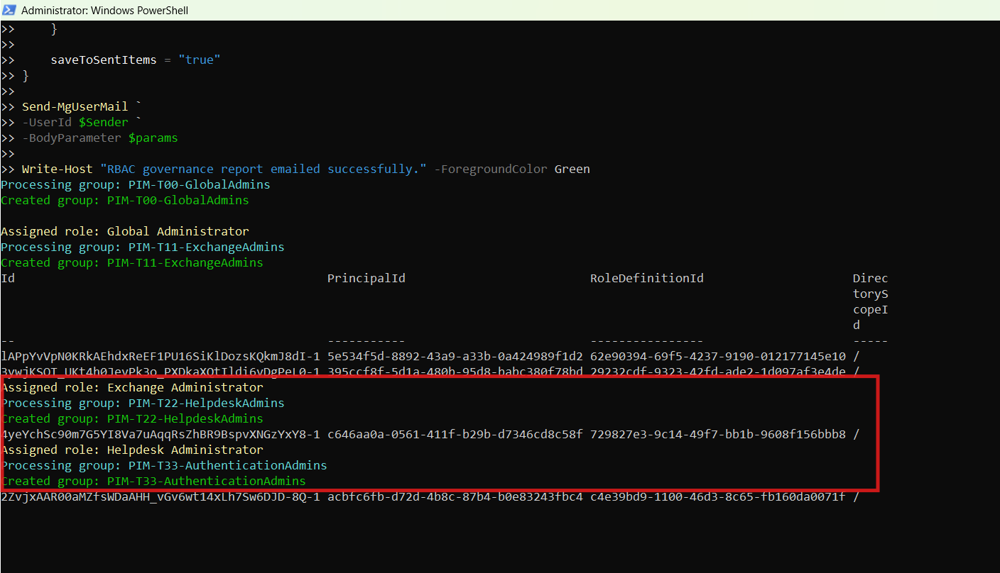

<html> <h1>Automate Entra ID RBAC Governance with Role-Assignable Groups</h1> 
 This script helps administrators automate <b>Microsoft Entra RBAC governance</b> by creating role-assignable groups, assigning administrative roles, validating governance standards, and generating automated governance reports. 
 
 <h2>📌 Overview</h2> 
 Role-Assignable Groups are a recommended approach for managing administrative access in Microsoft Entra ID. However, without governance controls, role assignments can become difficult to manage and audit. 
 
 This script automates the provisioning and governance review process by creating role-assignable groups from a CSV file, assigning Entra roles, validating naming standards, detecting excessive role assignments, calculating governance scores, and generating security reports. 
 
This script enables you to:
 <ul> <li>Create role-assignable groups in bulk</li> <li>Assign Entra administrative roles automatically</li> <li>Detect duplicate RBAC groups</li> <li>Validate naming convention compliance</li> <li>Identify excessive role assignments</li> <li>Flag critical role assignments</li> <li>Calculate governance scores</li> <li>Email governance reports automatically</li> </ul> 
 <h2>🚀 Features</h2> <ul> <li>CSV-driven RBAC group creation</li> <li>Automatic role activation when required</li> <li>Role assignment automation</li> <li>Duplicate group detection</li> <li>Naming convention validation</li> <li>Critical role monitoring</li> <li>Governance score calculation</li> <li>Dry-run validation mode</li> <li>CSV reporting and email notifications</li> </ul> 
 <h2>🛠 Governance Checks Included</h2> <ul> <li>Duplicate role-assignable groups</li> <li>Naming convention violations</li> <li>Excessive role assignments</li> <li>Critical role assignments</li> <li>Invalid role definitions</li> </ul> 
 <h2>🛠 Prerequisites</h2> <ul> <li>Microsoft Graph PowerShell module</li> <li>Microsoft Entra ID Premium licensing (recommended)</li> <li>Required permissions: <ul> <li><code>Group.ReadWrite.All</code></li> <li><code>RoleManagement.ReadWrite.Directory</code></li> <li><code>Directory.ReadWrite.All</code></li> <li><code>Mail.Send</code></li> </ul> </li> </ul> 
Connect using:
 <pre> Connect-MgGraph -Scopes ` "Group.ReadWrite.All", "RoleManagement.ReadWrite.Directory", "Directory.ReadWrite.All", "Mail.Send" </pre> 
 <h2>📂 Files Included</h2> <ul> <li><code>automate-entra-id-rbac-governance-with-role-assignable-groups.ps1</code> — PowerShell script</li> <li><code>README.md</code> — Script overview and usage notes</li> <li><code>demo.png</code> — Sample output image</li> </ul> 
 <h2>📊 Sample Input (CSV)</h2> 
The script expects a CSV file similar to:
 <pre> GroupName,MailNickname,RoleNames PIM-T1-GlobalAdmins,pimglobal,Global Administrator PIM-T2-IdentityAdmins,pimidentity,Authentication Administrator PIM-T3-SecurityAdmins,pimsecurity,Security Administrator </pre> 
 <h2>📊 Governance Report Details</h2> 
The generated report includes:
 <ul> <li>Group Name</li> <li>Assigned Roles</li> <li>Status</li> <li>Severity</li> <li>Risk Findings</li> <li>Governance Score</li> <li>Recommendations</li> </ul> 
 <h2>📊 Sample Output</h2> 
Below is a sample output of the script execution:
  
<em>📌 The image above is sourced from the original M365Corner article.</em>
 
 <h2>🎯 Use Cases</h2> <ul> <li>Standardize Entra RBAC administration</li> <li>Implement role-assignable group governance</li> <li>Automate privileged access onboarding</li> <li>Reduce RBAC configuration drift</li> <li>Improve administrative access governance</li> <li>Support compliance and audit initiatives</li> </ul> 
 <h2>🌐 Detailed Guide</h2> 
 For full script, explanation, and enhancements: 
 
 👉 <a href="https://m365corner.com/m365-powershell/automate-entra-id-rbac-governance-with-powershell.html" target="_blank"> View Detailed Article on M365Corner </a> 
 
 <h2>⚠️ Critical Roles Monitored</h2> <ul> <li>Global Administrator</li> <li>Privileged Role Administrator</li> <li>Authentication Administrator</li> </ul> 
 <h2>⚠️ Important Considerations</h2> <ul> <li>Review role assignments before production deployment</li> <li>Dry-run mode should be used for initial validation</li> <li>Naming convention regex can be customized to organizational standards</li> <li>Role-assignable groups cannot be converted after creation</li> </ul> 
 <h2>⚠️ Notes</h2> <ul> <li>The script automatically activates directory roles if required</li> <li>Critical roles reduce governance scores significantly</li> <li>Email includes summary statistics and a preview of processed groups</li> <li>Governance reports can be scheduled for recurring reviews</li> </ul> 
 <h2>⭐ Support</h2> 
If you find this useful:
 <ul> <li>Star ⭐ the repository</li> <li>Share with fellow administrators</li> </ul> 
 <h2>📌 About M365Corner</h2> 
 M365Corner provides practical Microsoft 365 PowerShell scripts and admin guides to simplify day-to-day operations. 
 
 👉 <a href="https://m365corner.com" target="_blank">https://m365corner.com</a> 
 </html>