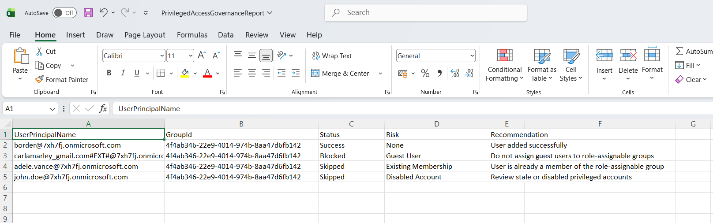

<html> <h1>Automate Privileged Access Governance with Role-Assignable Groups</h1> 
 This script helps administrators automate <b>privileged access governance</b> in Microsoft Entra ID using role-assignable groups and Microsoft Graph PowerShell. 
 
 <h2>📌 Overview</h2> 
 Managing privileged administrative access at scale can become difficult when role assignments are granted directly to users. Role-Assignable Groups provide a more secure and manageable model by centralizing privileged access assignments. 
 
 This script automates the governance process by provisioning role-assignable groups, assigning privileged roles, validating governance standards, identifying risky assignments, and generating governance reports. 
 
This script enables you to:
 <ul> <li>Create and manage privileged access groups</li> <li>Assign administrative roles through groups</li> <li>Reduce direct role assignments to users</li> <li>Monitor privileged access governance posture</li> <li>Identify risky or excessive role assignments</li> <li>Generate governance reports automatically</li> <li>Email governance summaries to administrators</li> </ul> 
 <h2>🚀 Features</h2> <ul> <li>Automates role-assignable group provisioning</li> <li>Assigns privileged Entra roles through groups</li> <li>Detects duplicate privileged access groups</li> <li>Validates governance naming standards</li> <li>Monitors critical administrative roles</li> <li>Calculates governance health scores</li> <li>Exports governance findings to CSV</li> <li>Sends automated HTML email reports</li> </ul> 
 <h2>🛠 Governance Checks Included</h2> <ul> <li>Duplicate role-assignable groups</li> <li>Improper naming conventions</li> <li>Excessive privileged role assignments</li> <li>Critical administrative role assignments</li> <li>Role governance violations</li> </ul> 
 <h2>🛠 Prerequisites</h2> <ul> <li>Microsoft Graph PowerShell module</li> <li>Microsoft Entra ID Premium licensing (recommended)</li> <li>Required permissions: <ul> <li><code>Group.ReadWrite.All</code></li> <li><code>RoleManagement.ReadWrite.Directory</code></li> <li><code>Directory.ReadWrite.All</code></li> <li><code>Mail.Send</code></li> </ul> </li> </ul> 
Connect using:
 <pre> Connect-MgGraph -Scopes ` "Group.ReadWrite.All", "RoleManagement.ReadWrite.Directory", "Directory.ReadWrite.All", "Mail.Send" </pre> 
 <h2>📂 Files Included</h2> <ul> <li><code>automate-privileged-access-governance-with-role-assignable-group.ps1</code> — PowerShell script</li> <li><code>README.md</code> — Script overview and usage notes</li> <li><code>demo.png</code> — Sample output image</li> </ul> 
 <h2>📊 Governance Report Details</h2> 
The generated report includes:
 <ul> <li>Role-Assignable Group Name</li> <li>Assigned Role</li> <li>Assignment Status</li> <li>Governance Findings</li> <li>Severity Level</li> <li>Governance Score</li> <li>Recommended Actions</li> </ul> 
 <h2>📊 Sample Output</h2> 
Below is a sample output of the script execution:
  
<em>📌 The image above is sourced from the original M365Corner article.</em>
 
 <h2>🎯 Use Cases</h2> <ul> <li>Implement role-based privileged access governance</li> <li>Reduce direct user role assignments</li> <li>Improve administrative access management</li> <li>Support least-privilege initiatives</li> <li>Strengthen Entra RBAC governance</li> <li>Prepare for compliance and security audits</li> </ul> 
 <h2>🌐 Detailed Guide</h2> 
 For full script, explanation, and enhancements: 
 
 👉 <a href="https://m365corner.com/m365-powershell/automate-privileged-access-governance-with-graph-powershell.html" target="_blank"> View Detailed Article on M365Corner </a> 
 
 <h2>⚠️ Critical Roles Commonly Governed</h2> <ul> <li>Global Administrator</li> <li>Privileged Role Administrator</li> <li>Authentication Administrator</li> <li>Security Administrator</li> <li>User Administrator</li> </ul> 
 <h2>⚠️ Important Considerations</h2> <ul> <li>Review role assignments before production deployment</li> <li>Use role-assignable groups instead of direct user assignments whenever possible</li> <li>Validate naming standards against organizational policies</li> <li>Monitor critical role assignments regularly</li> </ul> 
 <h2>⚠️ Notes</h2> <ul> <li>Role-assignable groups simplify privileged access governance</li> <li>Governance scores help prioritize remediation efforts</li> <li>Email reports provide quick visibility into governance posture</li> <li>Can be scheduled for recurring governance reviews</li> </ul> 
 <h2>⭐ Support</h2> 
If you find this useful:
 <ul> <li>Star ⭐ the repository</li> <li>Share with fellow administrators</li> </ul> 
 <h2>📌 About M365Corner</h2> 
 M365Corner provides practical Microsoft 365 PowerShell scripts and admin guides to simplify day-to-day operations. 
 
 👉 <a href="https://m365corner.com" target="_blank">https://m365corner.com</a> 
 </html>