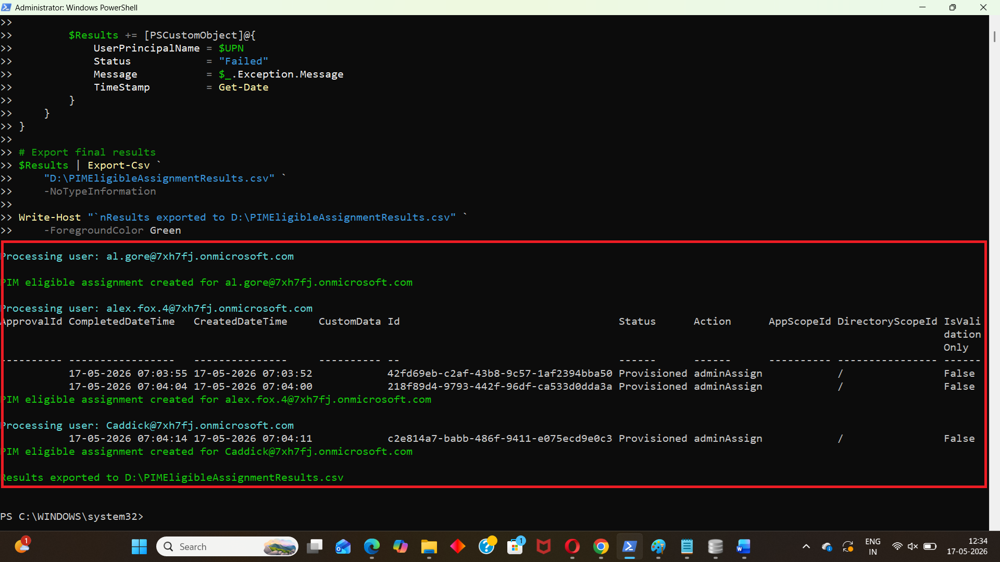

<html> <h1>Bulk Assign PIM Eligible Global Administrator Role</h1> 
 This script helps administrators <b>bulk assign Microsoft Entra Privileged Identity Management (PIM) eligible Global Administrator roles</b> using Microsoft Graph PowerShell. 
 
 <h2>📌 Overview</h2> 
 Privileged Identity Management (PIM) is a security best practice that reduces standing administrative access by making privileged roles eligible rather than permanently assigned. 
 
 This script automates the onboarding of multiple administrators into PIM by assigning the <b>Global Administrator</b> role as an eligible assignment based on a CSV input file. 
 
This script enables you to:
 <ul> <li>Bulk onboard administrators into PIM</li> <li>Assign Global Administrator eligibility instead of permanent access</li> <li>Prevent duplicate eligible assignments</li> <li>Track successful, skipped, and failed operations</li> <li>Export assignment results to CSV</li> </ul> 
 <h2>🚀 Features</h2> <ul> <li>Reads users from a CSV file</li> <li>Validates user existence before assignment</li> <li>Checks for existing eligible assignments</li> <li>Creates PIM eligibility schedule requests</li> <li>Supports bulk processing</li> <li>Exports detailed results to CSV</li> <li>Provides real-time console output</li> </ul> 
 <h2>🛠 Prerequisites</h2> <ul> <li>Microsoft Graph PowerShell module</li> <li>Microsoft Entra ID P2 licensing (required for PIM)</li> <li>Required permissions: <ul> <li><code>RoleManagement.ReadWrite.Directory</code></li> <li><code>Directory.ReadWrite.All</code></li> <li><code>User.Read.All</code></li> </ul> </li> </ul> 
Connect using:
 <pre> Connect-MgGraph -Scopes ` "RoleManagement.ReadWrite.Directory", "Directory.ReadWrite.All", "User.Read.All" </pre> 
 <h2>📂 Files Included</h2> <ul> <li><code>bulk-assign-pim-eligible-global-administrator-role-using-powershell.ps1</code> — PowerShell script</li> <li><code>README.md</code> — Script overview and usage notes</li> <li><code>demo.png</code> — Sample output image</li> </ul> 
 <h2>📊 Sample Input (CSV)</h2> 
The script expects a CSV file with the following structure:
 <pre> UserPrincipalName admin1@contoso.com admin2@contoso.com admin3@contoso.com </pre> 
 <h2>📊 Output Report Details</h2> 
The exported report includes:
 <ul> <li>User Principal Name</li> <li>Status</li> <li>Message</li> <li>Timestamp</li> </ul> 
 <h2>📊 Sample Output</h2> 
Below is a sample output of the script execution:
  
<em>📌 The image above is sourced from the original M365Corner article.</em>
 
 <h2>🎯 Use Cases</h2> <ul> <li>Bulk onboard administrators into PIM</li> <li>Replace standing Global Administrator assignments</li> <li>Support least-privilege security initiatives</li> <li>Accelerate PIM adoption projects</li> <li>Standardize privileged role onboarding processes</li> </ul> 
 <h2>🌐 Detailed Guide</h2> 
 For full script, explanation, and enhancements: 
 
 👉 <a href="https://m365corner.com/m365-powershell/bulk-assign-PIM-eligible-global-admin-role-using-powershell.html" target="_blank"> View Detailed Article on M365Corner </a> 
 
 <h2>⚠️ Important Considerations</h2> <ul> <li>PIM requires Microsoft Entra ID P2 licensing</li> <li>The script creates eligible assignments, not active assignments</li> <li>Existing eligible assignments are automatically skipped</li> <li>Review CSV contents before execution</li> </ul> 
 <h2>⚠️ Notes</h2> <ul> <li>The script creates eligibility assignments for one year by default</li> <li>Assignment duration can be modified by adjusting the schedule configuration</li> <li>Failures are captured and included in the results report</li> <li>Useful for large-scale privileged access onboarding projects</li> </ul> 
 <h2>⭐ Support</h2> 
If you find this useful:
 <ul> <li>Star ⭐ the repository</li> <li>Share with fellow administrators</li> </ul> 
 <h2>📌 About M365Corner</h2> 
 M365Corner provides practical Microsoft 365 PowerShell scripts and admin guides to simplify day-to-day operations. 
 
 👉 <a href="https://m365corner.com" target="_blank">https://m365corner.com</a> 
 </html>