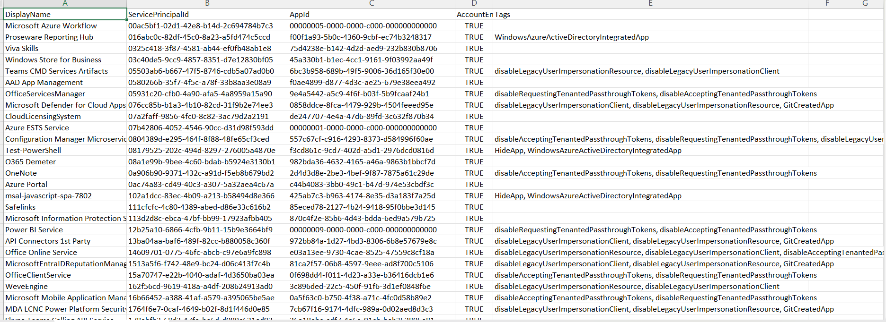

<html>

<h1>Generate Entra Service Principals Report</h1>

This script helps administrators generate a complete inventory of <b>Microsoft Entra Service Principals</b> using Microsoft Graph PowerShell.

<h2>📌 Overview</h2>

Service Principals represent enterprise applications and identities in Entra ID. Maintaining visibility into them is critical for governance, auditing, and security.

This script enables you to:

<ul>
<li>Retrieve all Service Principals in the tenant</li>
<li>View key properties such as status and tags</li>
<li>Export a complete inventory for analysis</li>
</ul>

<h2>🚀 Features</h2>

<ul>
<li>Fetches all Service Principals across the tenant</li>
<li>Displays enabled/disabled status</li>
<li>Captures key attributes such as AppId and Tags</li>
<li>Exports results to CSV for reporting</li>
<li>Provides real-time console output</li>
</ul>

<h2>🛠 Prerequisites</h2>

<ul>
<li>Microsoft Graph PowerShell module</li>
<li>Required permission:
    <ul>
        <li><code>Application.Read.All</code></li>
    </ul>
</li>
</ul>

Connect using:

<pre>
Connect-MgGraph -Scopes "Application.Read.All"
</pre>

<h2>📂 Files Included</h2>

<ul>
<li><code>generate-entra-service-principals-report.ps1</code> — PowerShell script</li>
<li><code>README.md</code> — Script overview and usage notes</li>
<li><code>demo.png</code> — Sample output image</li>
</ul>

<h2>📊 Sample Output</h2>

Below is a sample output of the script execution:

<em>📌 The image above is sourced from the original M365Corner article.</em>

<h2>🎯 Use Cases</h2>

<ul>
<li>Generate full Service Principal inventory</li>
<li>Support audit and compliance requirements</li>
<li>Review enabled vs disabled service principals</li>
<li>Identify unused or legacy applications</li>
</ul>

<h2>🌐 Detailed Guide</h2>

For full script, explanation, and enhancements:

👉 <a href="https://m365corner.com/m365-powershell/generate-entra-service-principals-report-using-powershell.html" target="_blank">
View Detailed Article on M365Corner
</a>

<h2>⚠️ Notes</h2>

<ul>
<li>This script provides a baseline inventory of all Service Principals</li>
<li>Use this report as a starting point for deeper analysis</li>
<li>Combine with other scripts for ownership, permissions, and risk insights</li>
</ul>

<h2>⭐ Support</h2>

If you find this useful:

<ul>
<li>Star ⭐ the repository</li>
<li>Share with fellow administrators</li>
</ul>

<h2>📌 About M365Corner</h2>

M365Corner provides practical Microsoft 365 PowerShell scripts and admin guides to simplify day-to-day operations.

👉 <a href="https://m365corner.com" target="_blank">https://m365corner.com</a>

</html>
