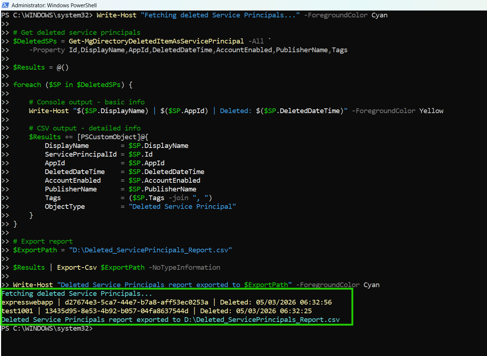

<html> <h1>Find Deleted Entra Service Principals</h1> 
 This script helps administrators identify <b>deleted Microsoft Entra Service Principals</b> using Microsoft Graph PowerShell. 
 
 <h2>📌 Overview</h2> 
 Deleted Service Principals may represent removed enterprise applications, deprecated integrations, or recently cleaned-up identities. Maintaining visibility into deleted objects is useful for auditing, investigations, and recovery planning. 
 
This script enables you to:
 <ul> <li>Retrieve deleted Service Principals from Entra ID</li> <li>Review deleted application identities</li> <li>Support audit and compliance activities</li> <li>Track cleanup and lifecycle events</li> </ul> 
 <h2>🚀 Features</h2> <ul> <li>Fetches deleted Service Principals from Entra ID</li> <li>Captures deletion timestamp and application details</li> <li>Exports results to CSV for analysis</li> <li>Provides real-time console output</li> <li>Includes publisher and tag information</li> </ul> 
 <h2>🛠 Prerequisites</h2> <ul> <li>Microsoft Graph PowerShell module</li> <li>Required permissions: <ul> <li><code>Directory.Read.All</code></li> <li><code>Application.Read.All</code></li> </ul> </li> </ul> 
Connect using:
 <pre> Connect-MgGraph -Scopes "Directory.Read.All","Application.Read.All" </pre> 
 <h2>📂 Files Included</h2> <ul> <li><code>find-deleted-entra-service-principals.ps1</code> — PowerShell script</li> <li><code>README.md</code> — Script overview and usage notes</li> <li><code>demo.png</code> — Sample output image</li> </ul> 
 <h2>📊 Sample Output</h2> 
Below is a sample output of the script execution:
  
<em>📌 The image above is sourced from the original M365Corner article.</em>
 
 <h2>🎯 Use Cases</h2> <ul> <li>Audit deleted enterprise applications</li> <li>Track Service Principal lifecycle events</li> <li>Support incident investigations</li> <li>Review recently removed identities</li> <li>Assist with recovery planning</li> </ul> 
 <h2>🌐 Detailed Guide</h2> 
 For full script, explanation, and enhancements: 
 
 👉 <a href="https://m365corner.com/m365-powershell/find-deleted-entra-service-principals-using-powershell.html" target="\_blank"> View Detailed Article on M365Corner </a> 
 
 <h2>⚠️ Important Considerations</h2> <ul> <li>Deleted objects remain available only for the retention period supported by Entra ID</li> <li>Review deleted Service Principals before permanent cleanup</li> <li>Useful for auditing unexpected application removals</li> </ul> 
 <h2>⚠️ Notes</h2> <ul> <li>The script retrieves deleted Service Principals from the deleted items container</li> <li>Publisher and tag information are included when available</li> <li>Export path should be updated before execution</li> </ul> 
 <h2>⭐ Support</h2> 
If you find this useful:
 <ul> <li>Star ⭐ the repository</li> <li>Share with fellow administrators</li> </ul> 
 <h2>📌 About M365Corner</h2> 
 M365Corner provides practical Microsoft 365 PowerShell scripts and admin guides to simplify day-to-day operations. 
 
 👉 <a href="https://m365corner.com" target="\_blank">https://m365corner.com</a> 
 </html>

