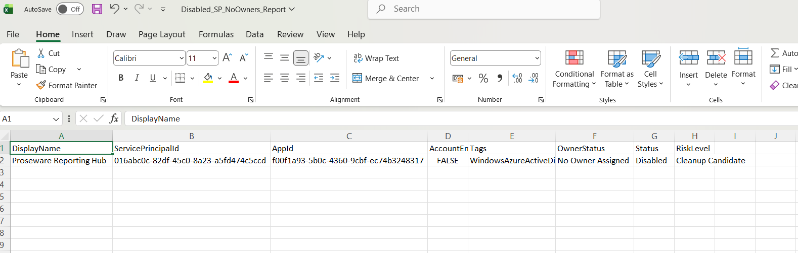

<html>

<h1>Find Disabled Entra Service Principals With No Owners</h1>

This script helps administrators identify <b>disabled Microsoft Entra Service Principals that have no assigned owners</b> using Microsoft Graph PowerShell.

<h2>📌 Overview</h2>

Service Principals that are both <b>disabled</b> and <b>unowned</b> are typically safe candidates for cleanup and removal, as they are unlikely to be actively used or maintained.

This script enables you to:

<ul>

<li>Identify disabled Service Principals</li>

<li>Detect Service Principals without owners</li>

<li>Pinpoint cleanup candidates</li>

<li>Improve tenant hygiene and governance</li>

</ul>

<h2>🚀 Features</h2>

<ul>

<li>Fetches all Service Principals in the tenant</li>

<li>Filters only disabled Service Principals</li>

<li>Checks for absence of assigned owners</li>

<li>Identifies cleanup candidates</li>

<li>Exports results to CSV for reporting</li>

<li>Provides real-time console output</li>

</ul>

<h2>🛠 Prerequisites</h2>

<ul>

<li>Microsoft Graph PowerShell module</li>

<li>Required permissions:

&#x20;   <ul>

&#x20;       <li><code>Application.Read.All</code></li>

&#x20;       <li><code>Directory.Read.All</code></li>

&#x20;   </ul>

</li>

</ul>

Connect using:

<pre>

Connect-MgGraph -Scopes "Application.Read.All","Directory.Read.All"

</pre>

<h2>📂 Files Included</h2>

<ul>

<li><code>find-disabled-entra-service-principals-with-no-owners.ps1</code> — PowerShell script</li>

<li><code>README.md</code> — Script overview and usage notes</li>

<li><code>demo.png</code> — Sample output image</li>

</ul>

<h2>📊 Sample Output</h2>

Below is a sample output of the script execution:

<em>📌 The image above is sourced from the original M365Corner article.</em>

<h2>🎯 Use Cases</h2>

<ul>

<li>Identify safe cleanup candidates</li>

<li>Remove unused or orphaned Service Principals</li>

<li>Improve Entra tenant hygiene</li>

<li>Support governance and audit activities</li>

</ul>

<h2>🌐 Detailed Guide</h2>

For full script, explanation, and enhancements:

👉 <https://m365corner.com/m365-powershell/find-disabled-entra-service-principals-with-no-owners.html

<h2>⚠️ Risk Classification</h2>

<ul>

<li><b>Disabled</b> → Not actively used</li>

<li><b>No Owner</b> → No accountability</li>

</ul>

👉 Combined classification: <b>Cleanup Candidate</b>

<h2>⚠️ Notes</h2>

<ul>

<li>Always validate before deletion to avoid breaking dependencies</li>

<li>Some Service Principals may still be required for legacy integrations</li>

<li>Best used as part of periodic cleanup activities</li>

</ul>

<h2>⭐ Support</h2>

If you find this useful:

<ul>

<li>Star ⭐ the repository</li>

<li>Share with fellow administrators</li>

</ul>

<h2>📌 About M365Corner</h2>

M365Corner provides practical Microsoft 365 PowerShell scripts and admin guides to simplify day-to-day operations.

👉 <a href="https://m365corner.com" target="\_blank">https://m365corner.com</a>

</html>

