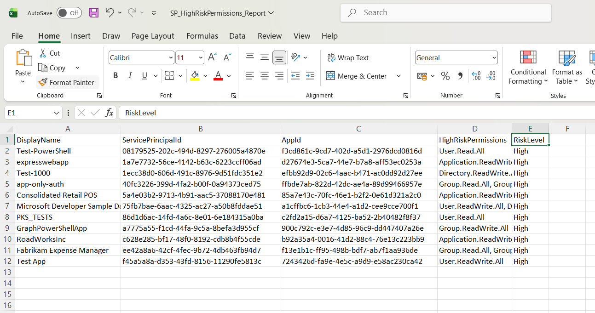

<html>

<h1>Find Entra Service Principals With High-Risk Permissions</h1>

This script helps administrators identify <b>Microsoft Entra Service Principals with high-risk permissions</b> using Microsoft Graph PowerShell.

<h2>📌 Overview</h2>

Service Principals with elevated permissions can pose significant security risks if not properly monitored and governed.

This script enables you to:

<ul>

<li>Identify Service Principals with high-risk permissions</li>

<li>Detect over-privileged applications</li>

<li>Strengthen security posture</li>

</ul>

<h2>🚀 Features</h2>

<ul>

<li>Fetches all Service Principals in the tenant</li>

<li>Evaluates assigned app role permissions</li>

<li>Matches permissions against a predefined high-risk list</li>

<li>Identifies Service Principals with elevated access</li>

<li>Exports results to CSV for analysis</li>

<li>Provides real-time console output</li>

</ul>

<h2>🛠 Prerequisites</h2>

<ul>

<li>Microsoft Graph PowerShell module</li>

<li>Required permission:

&#x20;   <ul>

&#x20;       <li><code>Application.Read.All</code></li>

&#x20;   </ul>

</li>

</ul>

Connect using:

<pre>

Connect-MgGraph -Scopes "Application.Read.All"

</pre>

<h2>📂 Files Included</h2>

<ul>

<li><code>find-entra-service-principals-with-high-risk-permissions.ps1</code> — PowerShell script</li>

<li><code>README.md</code> — Script overview and usage notes</li>

<li><code>demo.png</code> — Sample output image</li>

</ul>

<h2>📊 Sample Output</h2>

Below is a sample output of the script execution:

<em>📌 The image above is sourced from the original M365Corner article.</em>

<h2>🎯 Use Cases</h2>

<ul>

<li>Identify over-privileged Service Principals</li>

<li>Detect potential security risks</li>

<li>Support security audits and reviews</li>

<li>Improve least-privilege access enforcement</li>

</ul>

<h2>🌐 Detailed Guide</h2>

For full script, explanation, and enhancements: https://m365corner.com/m365-powershell/find-disabled-entra-service-principals-with-no-owners.html

<h2>⚠️ High-Risk Permissions Covered</h2>

<ul>

<li>Directory.ReadWrite.All</li>

<li>User.ReadWrite.All</li>

<li>Application.ReadWrite.All</li>

<li>RoleManagement.ReadWrite.Directory</li>

<li>Group.ReadWrite.All</li>

<li>AppRoleAssignment.ReadWrite.All</li>

<li>Directory.Read.All</li>

<li>User.Read.All</li>

<li>Group.Read.All</li>

</ul>

<h2>⚠️ Notes</h2>

<ul>

<li>High-risk permissions are predefined and can be customized</li>

<li>Review identified Service Principals before taking action</li>

<li>Combine with ownership and lifecycle scripts for deeper analysis</li>

</ul>

<h2>⭐ Support</h2>

If you find this useful:

<ul>

<li>Star ⭐ the repository</li>

<li>Share with fellow administrators</li>

</ul>

<h2>📌 About M365Corner</h2>

M365Corner provides practical Microsoft 365 PowerShell scripts and admin guides to simplify day-to-day operations.

👉 <a href="https://m365corner.com" target="\_blank">https://m365corner.com</a>

</html>

