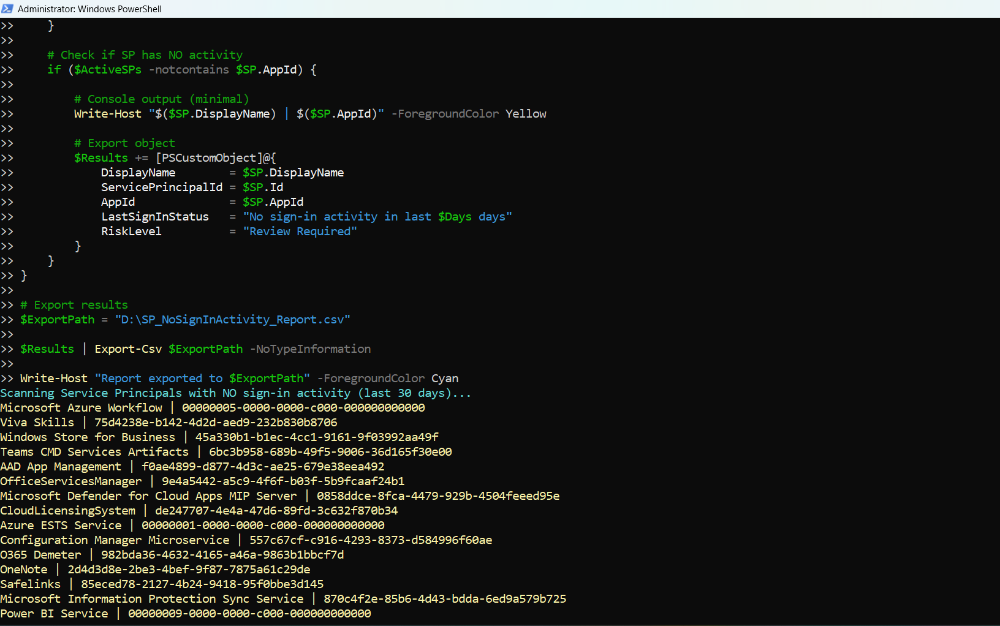

<html> <h1>Find Entra Service Principals With No Sign-In Activity</h1> 
 This script helps administrators identify <b>Microsoft Entra Service Principals with no sign-in activity</b> within the last 30 days using Microsoft Graph PowerShell. 
 
 <h2>📌 Overview</h2> 
 Unused or inactive Service Principals can represent governance and security risks if left unreviewed. This script identifies Service Principals that have not generated sign-in activity during a specified timeframe. 
 
This script enables you to:
 <ul> <li>Identify inactive Service Principals</li> <li>Detect unused enterprise applications</li> <li>Support cleanup and governance activities</li> <li>Reduce attack surface by reviewing inactive identities</li> </ul> 
 <h2>🚀 Features</h2> <ul> <li>Fetches all Service Principals in the tenant</li> <li>Retrieves sign-in logs for the last 30 days</li> <li>Identifies Service Principals with no activity</li> <li>Excludes Microsoft-managed applications (optional logic included)</li> <li>Exports detailed results to CSV</li> <li>Provides real-time console output</li> </ul> 
 <h2>🛠 Prerequisites</h2> <ul> <li>Microsoft Graph PowerShell module</li> <li>Required permissions: <ul> <li><code>Application.Read.All</code></li> <li><code>AuditLog.Read.All</code></li> </ul> </li> </ul> 
Connect using:
 <pre> Connect-MgGraph -Scopes "Application.Read.All","AuditLog.Read.All" </pre> 
 <h2>📂 Files Included</h2> <ul> <li><code>find-entra-service-principals-with-no-signin-activity.ps1</code> — PowerShell script</li> <li><code>README.md</code> — Script overview and usage notes</li> <li><code>demo.png</code> — Sample output image</li> </ul> 
 <h2>📊 Sample Output</h2> 
Below is a sample output of the script execution:
  
<em>📌 The image above is sourced from the original M365Corner article.</em>
 
 <h2>🎯 Use Cases</h2> <ul> <li>Identify inactive Service Principals</li> <li>Review unused enterprise applications</li> <li>Support Entra cleanup initiatives</li> <li>Improve identity governance and security posture</li> </ul> 
 <h2>🌐 Detailed Guide</h2> 
 For full script, explanation, and enhancements: 
 
 👉 <a href="https://m365corner.com/m365-powershell/find-entra-service-principals-with-no-sign-in-activity.html" target="_blank"> View Detailed Article on M365Corner </a> 
 
 <h2>⚠️ Important Considerations</h2> <ul> <li>The script checks sign-in activity for the last 30 days by default</li> <li>Microsoft-managed applications are excluded using tag filtering</li> <li>Inactive Service Principals should be reviewed before removal</li> </ul> 
 <h2>⚠️ Notes</h2> <ul> <li>Some Service Principals may operate infrequently but still be required</li> <li>Review business dependencies before cleanup</li> <li>The inactivity threshold can be adjusted by modifying the <code>$Days</code> variable</li> </ul> 
 <h2>⭐ Support</h2> 
If you find this useful:
 <ul> <li>Star ⭐ the repository</li> <li>Share with fellow administrators</li> </ul> 
 <h2>📌 About M365Corner</h2> 
 M365Corner provides practical Microsoft 365 PowerShell scripts and admin guides to simplify day-to-day operations. 
 
 👉 <a href="https://m365corner.com" target="_blank">https://m365corner.com</a> 
 </html>