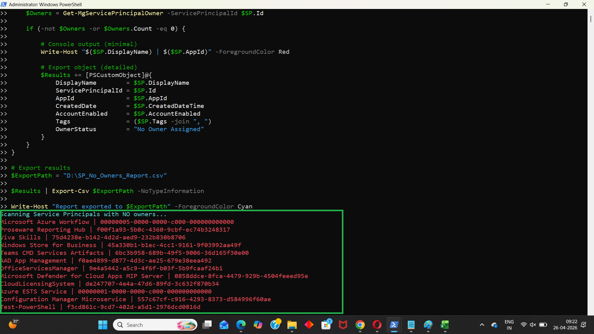

<html>

<h1>Find Entra Service Principals Without Owners</h1>

This script helps administrators identify Microsoft Entra <b>Service Principals without assigned owners</b> using Microsoft Graph PowerShell.

<h2>📌 Overview</h2>

Service Principals without owners represent a governance and security risk, as there is no accountability for managing or monitoring them.

This script enables you to:

<ul>

<li>Identify orphaned Service Principals</li>

<li>Detect governance gaps</li>

<li>Improve accountability and ownership</li>

</ul>

<h2>🚀 Features</h2>

<ul>

<li>Retrieves all Service Principals in the tenant</li>

<li>Checks for assigned owners</li>

<li>Identifies Service Principals with no owners</li>

<li>Exports detailed results to CSV</li>

<li>Displays findings in console output</li>

</ul>

<h2>🛠 Prerequisites</h2>

<ul>

<li>Microsoft Graph PowerShell module</li>

<li>Required permissions:

&#x20;   <ul>

&#x20;       <li><code>Application.Read.All</code></li>

&#x20;       <li><code>Directory.Read.All</code></li>

&#x20;   </ul>

</li>

</ul>

Connect using:

<pre>

Connect-MgGraph -Scopes "Application.Read.All","Directory.Read.All"

</pre>

<h2>📂 Files Included</h2>

<ul>

<li><code>find-entra-service-principals-without-owners.ps1</code> — PowerShell script</li>

<li><code>README.md</code> — Script overview and usage notes</li>

<li><code>demo.png</code> — Sample output image</li>

</ul>

<h2>📊 Sample Output</h2>

Below is a sample output of the script execution:

<em>📌 The image above is sourced from the original M365Corner article.</em>

<h2>🎯 Use Cases</h2>

<ul>

<li>Identify orphaned Service Principals</li>

<li>Improve Entra governance and accountability</li>

<li>Support security audits</li>

<li>Reduce unmanaged identity risks</li>

</ul>

<h2>🌐 Detailed Guide</h2>

For full script, explanation, and enhancements:

👉 <a href="https://m365corner.com/m365-powershell/find-entra-service-principals-without-owners-using-powershell.html" target="\_blank">

View Detailed Article on M365Corner

</a>

<h2>⚠️ Notes</h2>

<ul>

<li>Service Principals without owners should be reviewed and assigned ownership</li>

<li>Ensure proper governance policies are in place</li>

<li>Useful for periodic identity and access reviews</li>

</ul>

<h2>⭐ Support</h2>

If you find this useful:

<ul>

<li>Star ⭐ the repository</li>

<li>Share with fellow administrators</li>

</ul>

<h2>📌 About M365Corner</h2>

M365Corner provides practical Microsoft 365 PowerShell scripts and admin guides to simplify day-to-day operations.

👉 <a href="https://m365corner.com" target="\_blank">https://m365corner.com</a>

</html>

