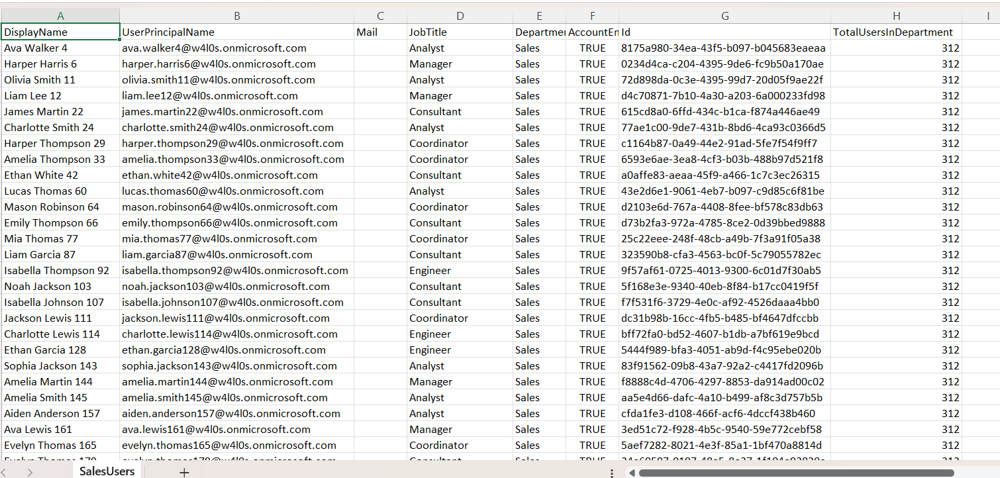

<html> <h1>Find Entra ID Users by Department</h1> 
 This script helps administrators <b>retrieve Microsoft Entra ID users belonging to a specific department</b> using Microsoft Graph PowerShell. 
 
 <h2>📌 Overview</h2> 
 Departments are commonly used to organize users and drive administrative processes such as license assignment, reporting, access reviews, and compliance checks. This script retrieves all users from a specified department and exports the results to a CSV file for further analysis. 
 
This script enables you to:
 <ul> <li>Retrieve users from a specific department</li> <li>View department membership in the console</li> <li>Generate department-wise user reports</li> <li>Export results to CSV</li> <li>Display the total number of users in the department</li> </ul> 
 <h2>🚀 Features</h2> <ul> <li>Retrieves users using Microsoft Graph PowerShell</li> <li>Filters users by department name</li> <li>Displays user details in the console</li> <li>Calculates the total department user count</li> <li>Exports detailed results to CSV</li> <li>Includes account status and job title information</li> </ul> 
 <h2>🛠 Prerequisites</h2> <ul> <li>Microsoft Graph PowerShell module</li> <li>Required permission: <ul> <li><code>User.Read.All</code></li> </ul> </li> </ul> 
Connect using:
 <pre> Connect-MgGraph -Scopes "User.Read.All" </pre> 
 <h2>📂 Files Included</h2> <ul> <li><code>find-entra-id-users-by-department.ps1</code> — PowerShell script</li> <li><code>README.md</code> — Script overview and usage notes</li> <li><code>demo.png</code> — Sample output image</li> </ul> 
 <h2>📊 Report Details</h2> 
The exported report includes:
 <ul> <li>Display Name</li> <li>User Principal Name</li> <li>Email Address</li> <li>Job Title</li> <li>Department</li> <li>Account Enabled Status</li> <li>User Object ID</li> <li>Total Users in the Department</li> </ul> 
 <h2>📊 Sample Output</h2> 
Below is a sample output of the script execution:
  
<em>📌 The image above is sourced from the original M365Corner article.</em>
 
 <h2>🎯 Use Cases</h2> <ul> <li>Generate department-wise user inventories</li> <li>Support license assignment projects</li> <li>Review departmental account ownership</li> <li>Prepare audit and compliance reports</li> <li>Verify organizational user distribution</li> </ul> 
 <h2>🌐 Detailed Guide</h2> 
 For full script, explanation, and enhancements: 
 
 👉 <a href="https://m365corner.com/m365-powershell/filter-entra-id-users-by-department-using-powershell.html" target="_blank"> View Detailed Article on M365Corner </a> 
 
 <h2>⚠️ Important Considerations</h2> <ul> <li>Update the <code>$Department</code> variable before running the script</li> <li>Ensure the export folder exists before execution</li> <li>Department names must match the values stored in Microsoft Entra ID</li> <li>Results depend on the accuracy of the department attribute</li> </ul> 
 <h2>⚠️ Notes</h2> <ul> <li>The script retrieves all matching users across the tenant</li> <li>Console output provides a quick summary before export</li> <li>The CSV includes the total number of users in the selected department</li> <li>Useful for recurring departmental reporting and administration</li> </ul> 
 <h2>⭐ Support</h2> 
If you find this useful:
 <ul> <li>Star ⭐ the repository</li> <li>Share with fellow administrators</li> </ul> 
 <h2>📌 About M365Corner</h2> 
 M365Corner provides practical Microsoft 365 PowerShell scripts and admin guides to simplify day-to-day operations. 
 
 👉 <a href="https://m365corner.com" target="_blank">https://m365corner.com</a> 
 </html>