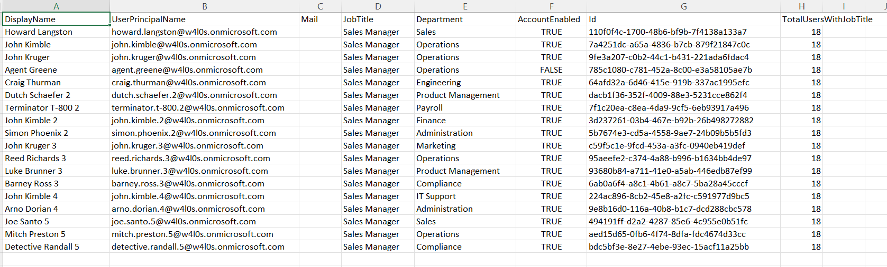

<html> <h1>Find Entra ID Users by Job Title</h1> 
 This script helps administrators <b>retrieve Microsoft Entra ID users based on their job title</b> using Microsoft Graph PowerShell. 
 
 <h2>📌 Overview</h2> 
 Job titles are frequently used to identify users with similar responsibilities for reporting, licensing, access reviews, and organizational planning. This script retrieves all users matching a specified job title and exports the results to a CSV file. 
 
This script enables you to:
 <ul> <li>Retrieve users by job title</li> <li>Display matching users in the console</li> <li>Generate job title-specific reports</li> <li>Export detailed results to CSV</li> <li>View the total number of matching users</li> </ul> 
 <h2>🚀 Features</h2> <ul> <li>Uses Microsoft Graph PowerShell to query Entra ID users</li> <li>Filters users based on the specified job title</li> <li>Displays matching users in a formatted table</li> <li>Exports detailed results to CSV</li> <li>Includes department and account status information</li> <li>Displays the total number of matching users</li> </ul> 
 <h2>🛠 Prerequisites</h2> <ul> <li>Microsoft Graph PowerShell module</li> <li>Required permission: <ul> <li><code>User.Read.All</code></li> </ul> </li> </ul> 
Connect using:
 <pre> Connect-MgGraph -Scopes "User.Read.All" </pre> 
 <h2>📂 Files Included</h2> <ul> <li><code>find-entra-id-users-by-jobtitle.ps1</code> — PowerShell script</li> <li><code>README.md</code> — Script overview and usage notes</li> <li><code>demo.png</code> — Sample output image</li> </ul> 
 <h2>📊 Report Details</h2> 
The exported report includes:
 <ul> <li>Display Name</li> <li>User Principal Name</li> <li>Email Address</li> <li>Job Title</li> <li>Department</li> <li>Account Enabled Status</li> </ul> 
 <h2>📊 Sample Output</h2> 
Below is a sample output of the script execution:
  
<em>📌 The image above is sourced from the original M365Corner article.</em>
 
 <h2>🎯 Use Cases</h2> <ul> <li>Generate role-based user inventories</li> <li>Identify employees with a specific job function</li> <li>Support license and access reviews</li> <li>Prepare HR and compliance reports</li> <li>Validate organizational role assignments</li> </ul> 
 <h2>🌐 Detailed Guide</h2> 
 For full script, explanation, and enhancements: 
 
 👉 <a href="https://m365corner.com/m365-powershell/find-entra-id-users-by-jobtitle-using-powershell.html" target="_blank"> View Detailed Article on M365Corner </a> 
 
 <h2>⚠️ Important Considerations</h2> <ul> <li>Update the <code>$JobTitle</code> variable before running the script</li> <li>Ensure the export folder exists before execution</li> <li>Job title values must exactly match those stored in Microsoft Entra ID</li> <li>Results depend on accurate population of the <code>jobTitle</code> attribute</li> </ul> 
 <h2>⚠️ Notes</h2> <ul> <li>The script retrieves all users with the specified job title across the tenant</li> <li>Console output provides a quick summary before export</li> <li>The CSV report is suitable for further filtering and analysis</li> <li>Ideal for recurring administrative and compliance reporting</li> </ul> 
 <h2>⭐ Support</h2> 
If you find this useful:
 <ul> <li>Star ⭐ the repository</li> <li>Share with fellow administrators</li> </ul> 
 <h2>📌 About M365Corner</h2> 
 M365Corner provides practical Microsoft 365 PowerShell scripts and admin guides to simplify day-to-day operations. 
 
 👉 <a href="https://m365corner.com" target="_blank">https://m365corner.com</a> 
 </html>