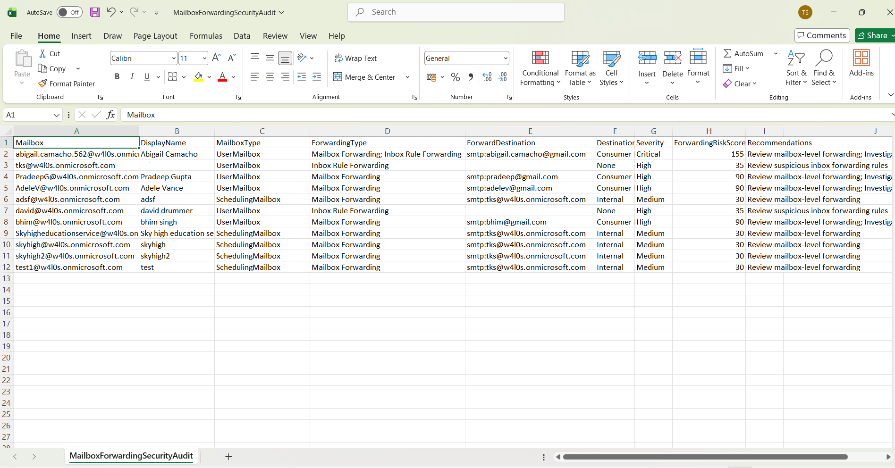

<html> <h1>Automate Exchange Online Mailbox Forwarding Security Audits</h1> 
 This script helps administrators automate <b>Exchange Online mailbox forwarding security audits</b> using Exchange Online PowerShell and Microsoft Graph PowerShell. 
 
 <h2>📌 Overview</h2> 
 Mailbox forwarding can be abused for data exfiltration, especially when forwarding is configured to external or consumer email domains. This script audits mailbox-level forwarding and inbox rule forwarding, assigns severity, calculates a risk score, and emails the report automatically. 
 
This script enables you to:
 <ul> <li>Detect mailbox-level forwarding</li> <li>Detect inbox rule-based forwarding</li> <li>Identify external and consumer-domain forwarding</li> <li>Calculate forwarding risk scores</li> <li>Export audit findings to CSV</li> <li>Email security audit reports automatically</li> </ul> 
 <h2>🚀 Features</h2> <ul> <li>Connects to Exchange Online and Microsoft Graph</li> <li>Retrieves all Exchange Online mailboxes</li> <li>Checks forwarding configured at mailbox level</li> <li>Checks forwarding configured through inbox rules</li> <li>Compares forwarding domains against verified tenant domains</li> <li>Flags forwarding to consumer domains such as Gmail, Yahoo, Outlook, Hotmail, and iCloud</li> <li>Assigns severity levels and forwarding risk scores</li> <li>Exports results to CSV</li> <li>Sends an HTML email report with CSV attachment</li> </ul> 
 <h2>🛠 Prerequisites</h2> <ul> <li>ExchangeOnlineManagement PowerShell module</li> <li>Microsoft Graph PowerShell module</li> <li>Exchange Online permissions to read mailboxes and inbox rules</li> <li>Required Microsoft Graph permissions: <ul> <li><code>User.Read.All</code></li> <li><code>Domain.Read.All</code></li> <li><code>Mail.Send</code></li> </ul> </li> </ul> 
Connect using:
 <pre> Connect-ExchangeOnline Connect-MgGraph -Scopes "User.Read.All","Domain.Read.All","Mail.Send" </pre> 
 <h2>📂 Files Included</h2> <ul> <li><code>automate-exchange-online-mailbox-forwarding-security-audits.ps1</code> — PowerShell script</li> <li><code>README.md</code> — Script overview and usage notes</li> <li><code>demo.png</code> — Sample output image</li> </ul> 
 <h2>📊 Audit Report Details</h2> 
The generated report includes:
 <ul> <li>Mailbox</li> <li>Display Name</li> <li>Mailbox Type</li> <li>Forwarding Type</li> <li>Forward Destination</li> <li>Destination Category</li> <li>Severity</li> <li>Forwarding Risk Score</li> <li>Recommendations</li> </ul> 
 <h2>📊 Sample Output</h2> 
Below is a sample output of the script execution:
  
<em>📌 The image above is sourced from the original M365Corner article.</em>
 
 <h2>🎯 Use Cases</h2> <ul> <li>Audit mailbox forwarding across Exchange Online</li> <li>Detect suspicious external forwarding</li> <li>Identify inbox rule forwarding risks</li> <li>Support email security investigations</li> <li>Automate recurring mailbox forwarding reviews</li> </ul> 
 <h2>🌐 Detailed Guide</h2> 
 For full script, explanation, and enhancements: 
 
 👉 <a href="https://m365corner.com/m365-powershell/automate-exchange-online-mailbox-forwarding-security-audits.html" target="_blank"> View Detailed Article on M365Corner </a> 
 
 <h2>⚠️ Important Considerations</h2> <ul> <li>Update sender and recipient email addresses before execution</li> <li>Ensure the export folder exists before running the script</li> <li>Review the consumer domain list and customize it if required</li> <li>Mailbox forwarding findings should be validated before remediation</li> </ul> 
 <h2>⚠️ Notes</h2> <ul> <li>The script adds higher risk scores for external and consumer-domain forwarding</li> <li>Multiple forwarding methods are treated as critical findings</li> <li>Shared mailboxes receive additional review recommendations</li> <li>Email includes a preview of the first 10 mailboxes with forwarding activity</li> </ul> 
 <h2>⭐ Support</h2> 
If you find this useful:
 <ul> <li>Star ⭐ the repository</li> <li>Share with fellow administrators</li> </ul> 
 <h2>📌 About M365Corner</h2> 
 M365Corner provides practical Microsoft 365 PowerShell scripts and admin guides to simplify day-to-day operations. 
 
 👉 <a href="https://m365corner.com" target="_blank">https://m365corner.com</a> 
 </html>