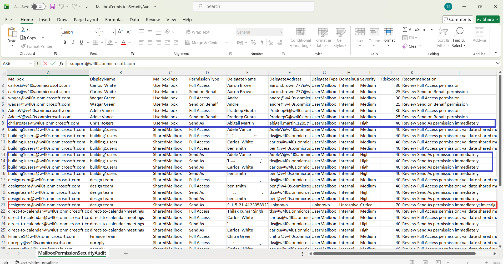

<html> <h1>Automate Exchange Online Mailbox Permission Security Audits</h1> 
 This script helps administrators automate <b>Exchange Online mailbox permission security audits</b> using Exchange Online PowerShell and Microsoft Graph PowerShell. 
 
 <h2>📌 Overview</h2> 
 Mailbox permissions are one of the most overlooked security risks in Exchange Online. Excessive Full Access, Send As, and Send on Behalf permissions can create unauthorized access paths and increase the risk of data exposure. 
 
This script enables you to:
 <ul> <li>Audit mailbox delegation permissions across the tenant</li> <li>Identify external or unresolved delegates</li> <li>Review Full Access permissions</li> <li>Review Send As permissions</li> <li>Review Send on Behalf permissions</li> <li>Calculate risk scores and severity levels</li> <li>Generate and email security audit reports automatically</li> </ul> 
 <h2>🚀 Features</h2> <ul> <li>Connects to Exchange Online and Microsoft Graph</li> <li>Audits User Mailboxes and Shared Mailboxes</li> <li>Reviews Full Access permissions</li> <li>Reviews Send As permissions</li> <li>Reviews Send on Behalf permissions</li> <li>Identifies external or unresolved delegates</li> <li>Assigns severity levels and risk scores</li> <li>Exports findings to CSV</li> <li>Sends automated HTML email reports</li> </ul> 
 <h2>🛠 Prerequisites</h2> <ul> <li>ExchangeOnlineManagement PowerShell module</li> <li>Microsoft Graph PowerShell module</li> <li>Required Microsoft Graph permissions: <ul> <li><code>Domain.Read.All</code></li> <li><code>Mail.Send</code></li> </ul> </li> <li>Exchange Online permissions to retrieve mailbox and recipient information</li> </ul> 
Connect using:
 <pre> Connect-ExchangeOnline Connect-MgGraph -Scopes "Domain.Read.All","Mail.Send" </pre> 
 <h2>📂 Files Included</h2> <ul> <li><code>automate-exchange-online-mailbox-permissions-security-audits.ps1</code> — PowerShell script</li> <li><code>README.md</code> — Script overview and usage notes</li> <li><code>demo.png</code> — Sample output image</li> </ul> 
 <h2>📊 Audit Report Details</h2> 
The generated report includes:
 <ul> <li>Mailbox</li> <li>Display Name</li> <li>Mailbox Type</li> <li>Permission Type</li> <li>Delegate Name</li> <li>Delegate Address</li> <li>Delegate Type</li> <li>Domain Category</li> <li>Severity</li> <li>Risk Score</li> <li>Recommendation</li> </ul> 
 <h2>📊 Permission Types Audited</h2> <ul> <li>Full Access</li> <li>Send As</li> <li>Send on Behalf</li> </ul> 
 <h2>📊 Sample Output</h2> 
Below is a sample output of the script execution:
  
<em>📌 The image above is sourced from the original M365Corner article.</em>
 
 <h2>🎯 Use Cases</h2> <ul> <li>Audit mailbox delegation permissions across Exchange Online</li> <li>Detect external mailbox delegates</li> <li>Identify excessive access assignments</li> <li>Support Exchange security reviews</li> <li>Automate recurring permission audits</li> <li>Strengthen mailbox access governance</li> </ul> 
 <h2>🌐 Detailed Guide</h2> 
 For full script, explanation, and enhancements: 
 
 👉 <a href="https://m365corner.com/m365-powershell/automate-exchange-online-mailbox-permission-security-audits.html" target="_blank"> View Detailed Article on M365Corner </a> 
 
 <h2>⚠️ Risk Scoring Logic</h2> <ul> <li>Full Access permissions receive baseline risk scoring</li> <li>Shared mailbox access increases risk score</li> <li>Send As permissions receive elevated risk ratings</li> <li>External or unresolved delegates increase severity levels</li> <li>Critical findings are assigned when high-risk permissions involve non-internal delegates</li> </ul> 
 <h2>⚠️ Important Considerations</h2> <ul> <li>Update sender and recipient email addresses before execution</li> <li>Ensure export folder exists before running the script</li> <li>Review external delegates carefully before remediation</li> <li>Validate business requirements before removing permissions</li> </ul> 
 <h2>⚠️ Notes</h2> <ul> <li>The script audits both User Mailboxes and Shared Mailboxes</li> <li>Verified tenant domains are used to classify delegates as internal or external</li> <li>Email report includes a preview of the first 10 findings</li> <li>Summary statistics are included in the email notification</li> </ul> 
 <h2>⭐ Support</h2> 
If you find this useful:
 <ul> <li>Star ⭐ the repository</li> <li>Share with fellow administrators</li> </ul> 
 <h2>📌 About M365Corner</h2> 
 M365Corner provides practical Microsoft 365 PowerShell scripts and admin guides to simplify day-to-day operations. 
 
 👉 <a href="https://m365corner.com" target="_blank">https://m365corner.com</a> 
 </html>