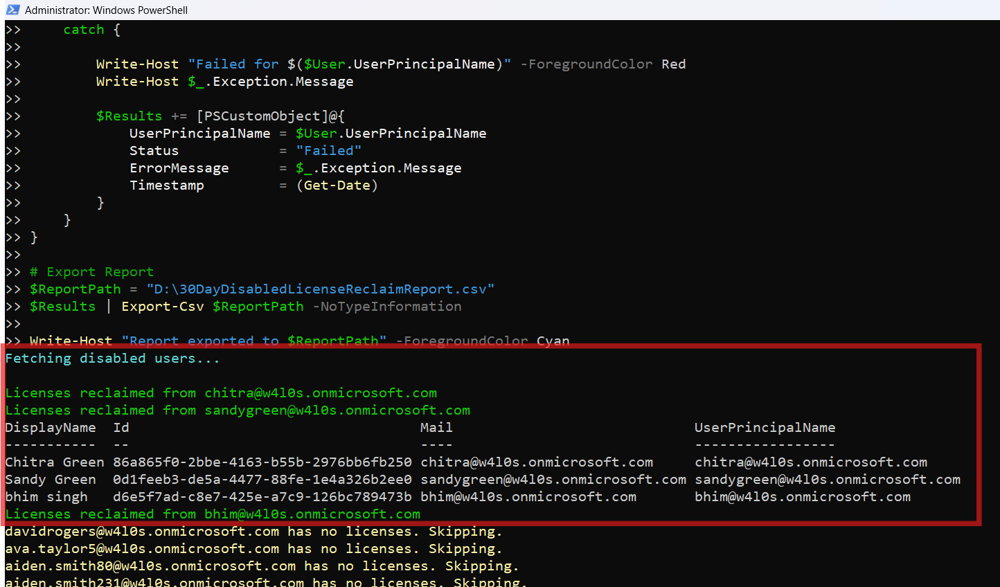

<html>

<h1>30 Day License Reclaimer for Disabled Users</h1>

This script helps administrators automatically reclaim Microsoft 365 licenses from <b>disabled users</b> who have been inactive for more than 30 days using Microsoft Graph PowerShell.

<h2>📌 Overview</h2>

Licenses assigned to disabled users can lead to unnecessary costs if not reclaimed in a timely manner.

This script enables you to:

<ul>
<li>Identify disabled users</li>
<li>Check last sign-in activity</li>
<li>Reclaim licenses after 30 days of inactivity</li>
<li>Generate a detailed audit report</li>
</ul>

<h2>🚀 Features</h2>

<ul>
<li>Fetches all disabled users in the tenant</li>
<li>Evaluates last sign-in activity</li>
<li>Applies a 30-day threshold for license reclamation</li>
<li>Automatically removes assigned licenses</li>
<li>Generates detailed CSV report with status tracking</li>
<li>Handles errors gracefully</li>
</ul>

<h2>🛠 Prerequisites</h2>

<ul>
<li>Microsoft Graph PowerShell module</li>
<li>Required permissions:
    <ul>
        <li><code>User.ReadWrite.All</code></li>
        <li><code>Organization.Read.All</code></li>
        <li><code>AuditLog.Read.All</code></li>
    </ul>
</li>
</ul>

Connect using:

<pre>
Connect-MgGraph -Scopes "User.ReadWrite.All","Organization.Read.All","AuditLog.Read.All"
</pre>

<h2>📂 Files Included</h2>

<ul>
<li><code>30-day-license-reclaimer-disabled-users.ps1</code> — PowerShell script</li>
<li><code>README.md</code> — Script overview and usage notes</li>
<li><code>demo.png</code> — Sample output image</li>
</ul>

<h2>📊 Sample Output</h2>

Below is a sample output of the script execution:

<h2>🎯 Use Cases</h2>

<ul>
<li>Reduce Microsoft 365 licensing costs</li>
<li>Automate license cleanup for disabled users</li>
<li>Improve license utilization efficiency</li>
<li>Support cost optimization initiatives</li>
</ul>

<h2>⚠️ Important Considerations</h2>

<ul>
<li>This script <b>removes licenses automatically</b> — test in a non-production environment first</li>
<li>Ensure business approval before reclaiming licenses</li>
<li>Validate threshold (30 days) based on your organization policy</li>
</ul>

<h2>⚠️ Notes</h2>

<ul>
<li>Users without sign-in activity are treated as eligible</li>
<li>Users disabled within 30 days are skipped</li>
<li>Users without licenses are skipped</li>
<li>Report includes success, skipped, and failed operations</li>
</ul>

<h2>⭐ Support</h2>

If you find this useful:

<ul>
<li>Star ⭐ the repository</li>
<li>Share with fellow administrators</li>
</ul>

<h2>📌 About M365Corner</h2>

M365Corner provides practical Microsoft 365 PowerShell scripts and admin guides to simplify day-to-day operations.

👉 <a href="https://m365corner.com" target="_blank">https://m365corner.com</a>

</html>
