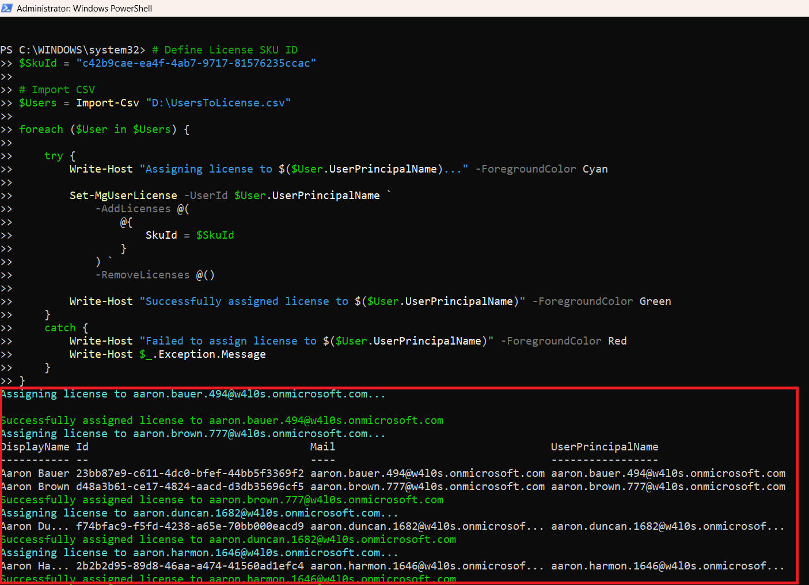

<html>

<h1>Bulk Assign License Report</h1>

This script helps administrators assign Microsoft 365 licenses to multiple users in bulk using Microsoft Graph PowerShell.

<h2>📌 Overview</h2>

Assigning licenses individually can be time-consuming in large environments. This script automates bulk license assignment using a CSV input file.

This script enables you to:

<ul>
<li>Assign licenses to multiple users in one go</li>
<li>Automate user onboarding processes</li>
<li>Reduce manual administrative effort</li>
</ul>

<h2>🚀 Features</h2>

<ul>
<li>Reads user list from CSV input</li>
<li>Assigns specified license SKU to each user</li>
<li>Handles errors gracefully</li>
<li>Provides real-time console feedback</li>
</ul>

<h2>🛠 Prerequisites</h2>

<ul>
<li>Microsoft Graph PowerShell module</li>
<li>Required permissions:
    <ul>
        <li><code>User.ReadWrite.All</code></li>
        <li><code>Organization.Read.All</code></li>
    </ul>
</li>
</ul>

Connect using:

<pre>
Connect-MgGraph -Scopes "User.ReadWrite.All","Organization.Read.All"
</pre>

<h2>📂 Files Included</h2>

<ul>
<li><code>bulk-assign-license-report.ps1</code> — PowerShell script</li>
<li><code>README.md</code> — Script overview and usage notes</li>
<li><code>demo.png</code> — Sample output image</li>
</ul>

<h2>📊 Sample Input (CSV)</h2>

The script expects a CSV file with the following format:

<pre>
UserPrincipalName
user1@domain.com
user2@domain.com
</pre>

<h2>📊 Sample Output</h2>

Below is a sample output of the script execution:

<h2>🎯 Use Cases</h2>

<ul>
<li>Bulk license assignment during onboarding</li>
<li>Assign licenses to department-wide users</li>
<li>Automate license provisioning</li>
<li>Reduce manual administrative effort</li>
</ul>

<h2>⚠️ Important Considerations</h2>

<ul>
<li>Ensure the correct <code>SkuId</code> is used before execution</li>
<li>Validate the input CSV file</li>
<li>Test in a non-production environment before large-scale execution</li>
</ul>

<h2>⚠️ Notes</h2>

<ul>
<li>Script assigns license without removing existing ones</li>
<li>Errors are captured and displayed in console</li>
<li>SKU ID must match the tenant’s subscribed licenses</li>
</ul>

🌐 Detailed Guide
For full script, explanation, and enhancements:
View Detailed Article on M365Corner👉 https://m365corner.com/m365-powershell/bulk-assign-microsoft-365-licenses-using-powershell.html

<h2>⭐ Support</h2>

If you find this useful:

<ul>
<li>Star ⭐ the repository</li>
<li>Share with fellow administrators</li>
</ul>

<h2>📌 About M365Corner</h2>

M365Corner provides practical Microsoft 365 PowerShell scripts and admin guides to simplify day-to-day operations.

👉 <a href="https://m365corner.com" target="_blank">https://m365corner.com</a>

</html>
