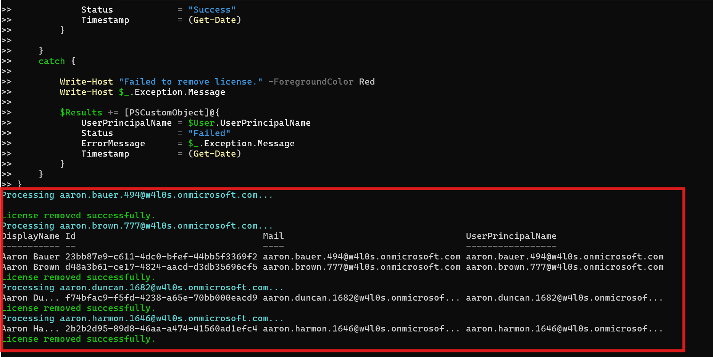

<html>

<h1>Bulk Remove License Report</h1>

This script helps administrators remove Microsoft 365 licenses from multiple users in bulk using Microsoft Graph PowerShell.

<h2>📌 Overview</h2>

Bulk license removal is essential for offboarding, cost optimization, and license reallocation. This script automates the removal process using a CSV input file.

This script enables you to:

<ul>

<li>Remove licenses from multiple users efficiently</li>

<li>Automate offboarding workflows</li>

<li>Track success, skipped, and failed operations</li>

</ul>

<h2>🚀 Features</h2>

<ul>

<li>Reads user list from CSV input</li>

<li>Validates if the license is assigned before removal</li>

<li>Removes specified license SKU</li>

<li>Tracks operation status (Success, Skipped, Failed)</li>

<li>Exports detailed report to CSV</li>

<li>Provides real-time console feedback</li>

</ul>

<h2>🛠 Prerequisites</h2>

<ul>

<li>Microsoft Graph PowerShell module</li>

<li>Required permissions:

&#x20;   <ul>

&#x20;       <li><code>User.ReadWrite.All</code></li>

&#x20;       <li><code>Organization.Read.All</code></li>

&#x20;   </ul>

</li>

</ul>

Connect using:

<pre>

Connect-MgGraph -Scopes "User.ReadWrite.All","Organization.Read.All"

</pre>

<h2>📂 Files Included</h2>

<ul>

<li><code>bulk-remove-license-report.ps1</code> — PowerShell script</li>

<li><code>README.md</code> — Script overview and usage notes</li>

<li><code>demo.png</code> — Sample output image</li>

</ul>

<h2>📊 Sample Input (CSV)</h2>

The script expects a CSV file with the following format:

<pre>

UserPrincipalName

user1@domain.com

user2@domain.com

</pre>

<h2>📊 Sample Output</h2>

Below is a sample output of the script execution:

<h2>🎯 Use Cases</h2>

<ul>

<li>Bulk license removal during offboarding</li>

<li>Reclaim unused licenses</li>

<li>Optimize licensing costs</li>

<li>Support cleanup and governance initiatives</li>

</ul>

<h2>⚠️ Important Considerations</h2>

<ul>

<li>Ensure correct <code>SkuId</code> is specified before execution</li>

<li>Validate the input CSV file</li>

<li>Test in a non-production environment before large-scale execution</li>

</ul>

<h2>⚠️ Notes</h2>

<ul>

<li>Users without the specified license are skipped</li>

<li>Errors are captured and included in the report</li>

<li>Report includes timestamp for each operation</li>

</ul>

🌐 Detailed Guide

For full script, explanation, and enhancements:

View Detailed Article on M365Corner👉 https://m365corner.com/m365-powershell/bulk-remove-microsoft-365-licenses-using-powershell.html

<h2>⭐ Support</h2>

If you find this useful:

<ul>

<li>Star ⭐ the repository</li>

<li>Share with fellow administrators</li>

</ul>

<h2>📌 About M365Corner</h2>

M365Corner provides practical Microsoft 365 PowerShell scripts and admin guides to simplify day-to-day operations.

👉 <a href="https://m365corner.com" target="\_blank">https://m365corner.com</a>

</html>

