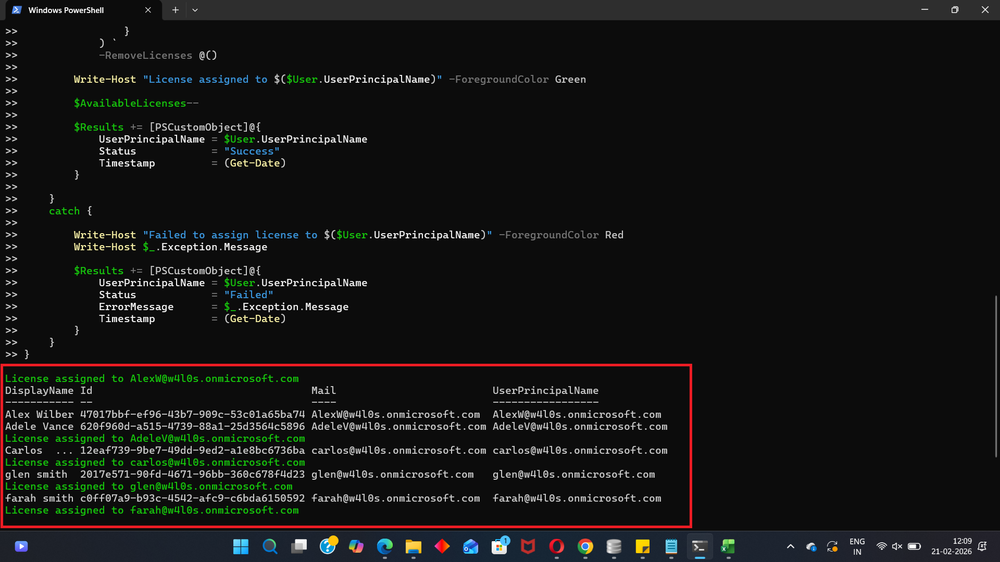

<html>

<h1>Department Based Licensing</h1>

This script helps administrators assign Microsoft 365 licenses to users based on their <b>department</b> value using Microsoft Graph PowerShell.

<h2>📌 Overview</h2>

Department-based licensing helps automate license assignment for users who belong to a specific department, reducing manual effort during onboarding or department-level provisioning.

This script enables you to:

<ul>
<li>Target users from a specific department</li>
<li>Check license availability before assignment</li>
<li>Skip users who already have the license</li>
<li>Generate a status report after execution</li>
</ul>

<h2>🚀 Features</h2>

<ul>
<li>Filters users by department</li>
<li>Validates SKU availability in the tenant</li>
<li>Checks available license count before assignment</li>
<li>Prevents duplicate license assignment</li>
<li>Tracks success, skipped, and failed operations</li>
<li>Exports results to CSV</li>
</ul>

<h2>🛠 Prerequisites</h2>

<ul>
<li>Microsoft Graph PowerShell module</li>
<li>Required permissions:
    <ul>
        <li><code>User.ReadWrite.All</code></li>
        <li><code>Organization.Read.All</code></li>
    </ul>
</li>
</ul>

Connect using:

<pre>
Connect-MgGraph -Scopes "User.ReadWrite.All","Organization.Read.All"
</pre>

<h2>📂 Files Included</h2>

<ul>
<li><code>department-based-licensing.ps1</code> — PowerShell script</li>
<li><code>README.md</code> — Script overview and usage notes</li>
<li><code>demo.png</code> — Sample output image</li>
</ul>

<h2>📊 Sample Output</h2>

Below is a sample output of the script execution:

<h2>🎯 Use Cases</h2>

<ul>
<li>Assign licenses to users in a specific department</li>
<li>Automate department-based onboarding</li>
<li>Standardize license provisioning</li>
<li>Reduce manual license assignment effort</li>
</ul>

<h2>⚠️ Important Considerations</h2>

<ul>
<li>Update <code>$DepartmentName</code> before running the script</li>
<li>Update <code>$SkuId</code> to match the required license in your tenant</li>
<li>Ensure enough licenses are available before execution</li>
<li>Test with a small department before using at scale</li>
</ul>

<h2>⚠️ Notes</h2>

<ul>
<li>Users who already have the selected license are skipped</li>
<li>The script stops assigning licenses when no licenses remain</li>
<li>Export report includes success, skipped, and failed status values</li>
<li>The department filter depends on accurate user profile data</li>
</ul>

🌐 Detailed Guide

For full script, explanation, and enhancements:

View Detailed Article on M365Corner👉 https://m365corner.com/m365-powershell/department-based-license-assignment-with-graph-powershell.html

<h2>⭐ Support</h2>

If you find this useful:

<ul>
<li>Star ⭐ the repository</li>
<li>Share with fellow administrators</li>
</ul>

<h2>📌 About M365Corner</h2>

M365Corner provides practical Microsoft 365 PowerShell scripts and admin guides to simplify day-to-day operations.

👉 <a href="https://m365corner.com" target="_blank">https://m365corner.com</a>

</html>
