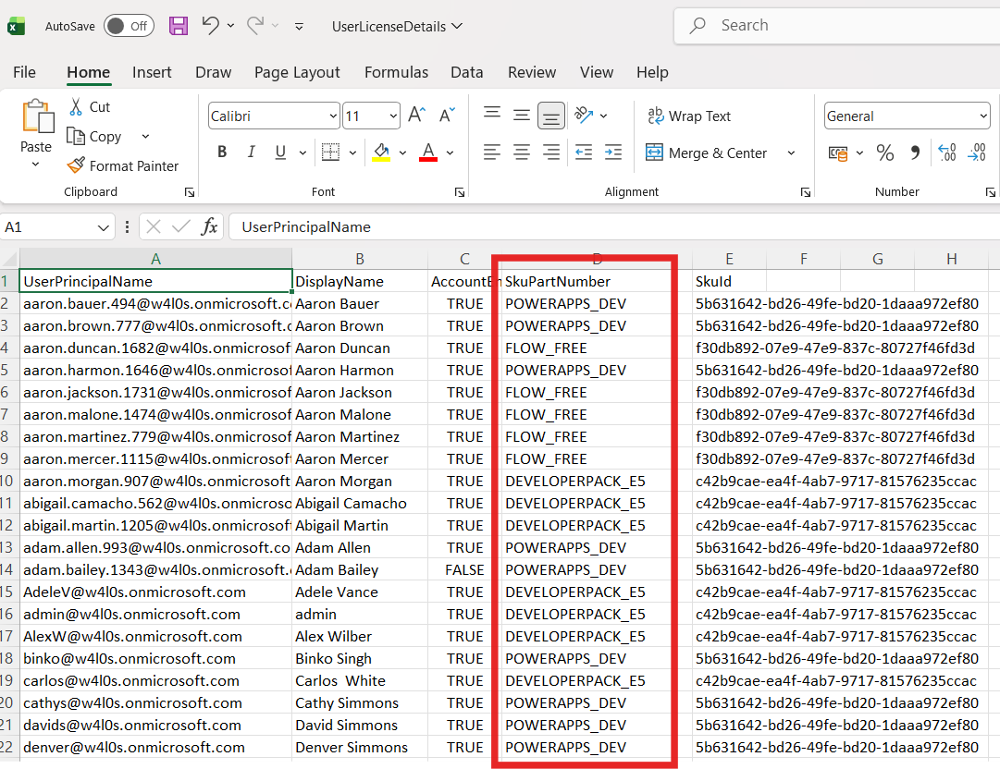

<html>

<h1>License Audit Report for Microsoft 365</h1>

This script helps administrators generate a comprehensive <b>Microsoft 365 license audit report</b> using Microsoft Graph PowerShell.

<h2>📌 Overview</h2>

Understanding license allocation and usage is critical for cost control, compliance, and operational efficiency.

This script enables you to:

<ul>

<li>View tenant-wide license summary</li>

<li>Track license consumption vs availability</li>

<li>Audit user-level license assignments</li>

<li>Identify unlicensed users</li>

</ul>

<h2>🚀 Features</h2>

<ul>

<li>Fetches all subscribed SKUs in the tenant</li>

<li>Builds a license summary (total, consumed, available)</li>

<li>Maps license IDs to readable SKU names</li>

<li>Generates detailed user-level license assignment report</li>

<li>Identifies users without licenses</li>

<li>Exports multiple reports for analysis</li>

</ul>

<h2>🛠 Prerequisites</h2>

<ul>

<li>Microsoft Graph PowerShell module</li>

<li>Required permissions:

&#x20;   <ul>

&#x20;       <li><code>User.Read.All</code></li>

&#x20;       <li><code>Organization.Read.All</code></li>

&#x20;   </ul>

</li>

</ul>

Connect using:

<pre>

Connect-MgGraph -Scopes "User.Read.All","Organization.Read.All"

</pre>

<h2>📂 Files Included</h2>

<ul>

<li><code>license-audit-report.ps1</code> — PowerShell script</li>

<li><code>README.md</code> — Script overview and usage notes</li>

<li><code>demo.png</code> — Sample output image</li>

</ul>

<h2>📊 Output Reports</h2>

This script generates the following CSV reports:

<ul>

<li><b>TenantLicenseSummary.csv</b> — License availability and usage</li>

<li><b>UserLicenseDetails.csv</b> — User-level license assignments</li>

<li><b>UnlicensedUsers.csv</b> — Users without assigned licenses</li>

</ul>

<h2>🎯 Use Cases</h2>

<ul>

<li>Perform tenant-wide license audits</li>

<li>Track license utilization and availability</li>

<li>Identify unused or underutilized licenses</li>

<li>Detect unlicensed users</li>

<li>Support cost optimization initiatives</li>

</ul>

<h2>⚠️ Important Considerations</h2>

<ul>

<li>Ensure export path is updated before running the script</li>

<li>Large tenants may take longer to process</li>

<li>Review reports carefully before making licensing decisions</li>

</ul>

<h2>⚠️ Notes</h2>

<ul>

<li>SKU mapping is handled using a lookup table</li>

<li>Users without licenses are captured separately</li>

<li>Reports are generated in CSV format for easy analysis</li>

</ul>

<h2>⭐ Support</h2>

If you find this useful:

<ul>

<li>Star ⭐ the repository</li>

<li>Share with fellow administrators</li>

</ul>

<h2>📌 About M365Corner</h2>

M365Corner provides practical Microsoft 365 PowerShell scripts and admin guides to simplify day-to-day operations.

👉 <a href="https://m365corner.com" target="\_blank">https://m365corner.com</a>

</html>

