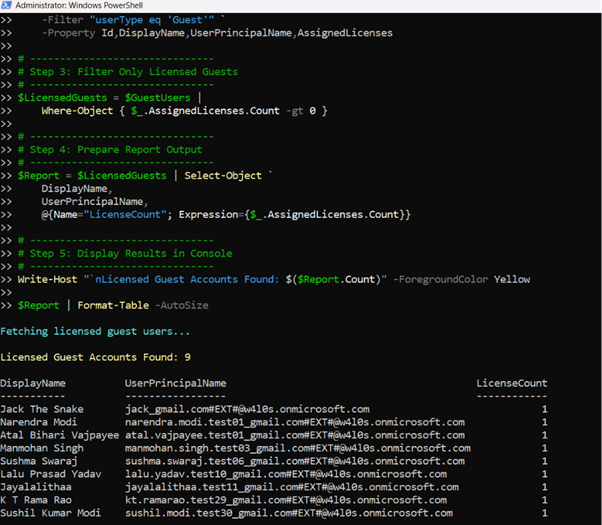

<html>

<h1>Licensed Guest Users Report</h1>

This script helps administrators identify <b>licensed guest users</b> in Microsoft Entra ID using Microsoft Graph PowerShell.

<h2>📌 Overview</h2>

Guest users are typically external collaborators and may not always require paid Microsoft 365 licenses.

This script enables you to:

<ul>

<li>Identify guest users in the tenant</li>

<li>Filter guest users with assigned licenses</li>

<li>Review external license usage</li>

<li>Export results for auditing and cost optimization</li>

</ul>

<h2>🚀 Features</h2>

<ul>

<li>Fetches all guest users from Microsoft Entra ID</li>

<li>Filters only users with assigned licenses</li>

<li>Counts number of licenses per guest user</li>

<li>Displays results in console</li>

<li>Exports report to CSV</li>

</ul>

<h2>🛠 Prerequisites</h2>

<ul>

<li>Microsoft Graph PowerShell module</li>

<li>Required permissions:

&#x20;   <ul>

&#x20;       <li><code>User.Read.All</code></li>

&#x20;       <li><code>Directory.Read.All</code></li>

&#x20;   </ul>

</li>

</ul>

Connect using:

<pre>

Connect-MgGraph -Scopes "User.Read.All","Directory.Read.All"

</pre>

<h2>📂 Files Included</h2>

<ul>

<li><code>licensed-guest-users-report.ps1</code> — PowerShell script</li>

<li><code>README.md</code> — Script overview and usage notes</li>

<li><code>demo.png</code> — Sample output image</li>

</ul>

<h2>📊 Sample Output</h2>

Below is a sample output of the script execution:

<h2>🎯 Use Cases</h2>

<ul>

<li>Audit external (guest) license usage</li>

<li>Identify unnecessary license assignments</li>

<li>Reduce licensing costs</li>

<li>Strengthen governance over external users</li>

</ul>

<h2>⚠️ Important Considerations</h2>

<ul>

<li>Guest users often do not require full licenses</li>

<li>Review business justification before removing licenses</li>

<li>Validate access requirements for external collaborators</li>

</ul>

<h2>⚠️ Notes</h2>

<ul>

<li>Only users with <code>userType = Guest</code> are considered</li>

<li>Users without licenses are excluded</li>

<li>License count per user is included in the report</li>

<li>Export path uses script directory (<code>$PSScriptRoot</code>)</li>

</ul>

<h2>⭐ Support</h2>

If you find this useful:

<ul>

<li>Star ⭐ the repository</li>

<li>Share with fellow administrators</li>

</ul>

<h2>📌 About M365Corner</h2>

M365Corner provides practical Microsoft 365 PowerShell scripts and admin guides to simplify day-to-day operations.

👉 <a href="https://m365corner.com" target="\_blank">https://m365corner.com</a>

</html>

