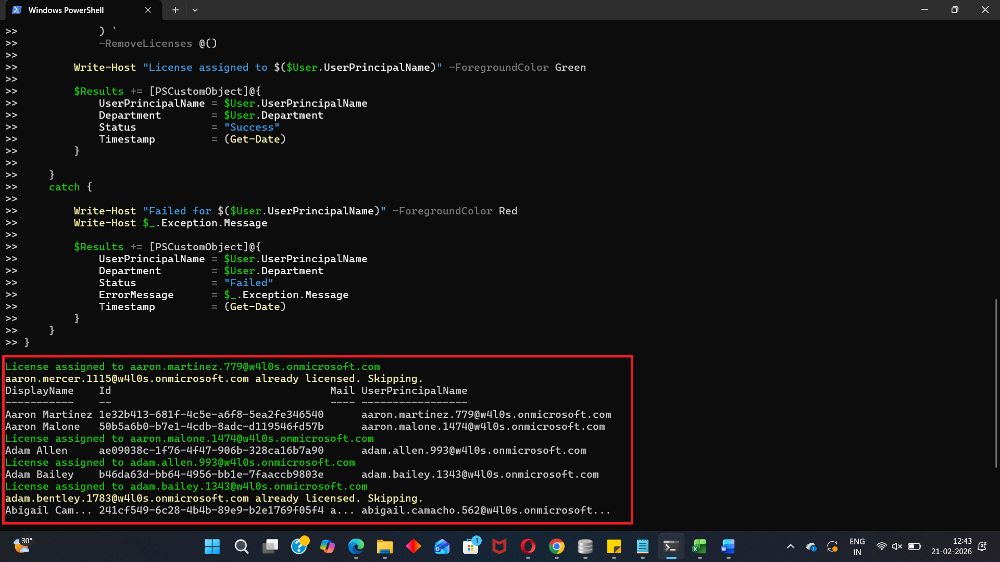

<html>

<h1>Multi-Department Based Licensing</h1>

This script helps administrators assign different Microsoft 365 licenses to users across multiple departments using Microsoft Graph PowerShell.

<h2>📌 Overview</h2>

Multi-department based licensing is useful when different teams require different Microsoft 365 services or license plans. This script uses a department-to-license mapping table to assign the correct license based on each user's department value.

This script enables you to:

<ul>
<li>Map multiple departments to different license SKUs</li>
<li>Assign licenses based on department values</li>
<li>Skip users who already have the required license</li>
<li>Generate a report of success, skipped, and failed operations</li>
</ul>

<h2>🚀 Features</h2>

<ul>
<li>Supports department-to-license mapping</li>
<li>Processes users across multiple departments</li>
<li>Validates SKU availability before assignment</li>
<li>Prevents duplicate license assignment</li>
<li>Tracks assignment status for each user</li>
<li>Exports results to CSV</li>
</ul>

<h2>🛠 Prerequisites</h2>

<ul>
<li>Microsoft Graph PowerShell module</li>
<li>Required permissions:
    <ul>
        <li><code>User.ReadWrite.All</code></li>
        <li><code>Organization.Read.All</code></li>
    </ul>
</li>
</ul>

Connect using:

<pre>
Connect-MgGraph -Scopes "User.ReadWrite.All","Organization.Read.All"
</pre>

<h2>📂 Files Included</h2>

<ul>
<li><code>multi-department-based-licensing.ps1</code> — PowerShell script</li>
<li><code>README.md</code> — Script overview and usage notes</li>
<li><code>demo.png</code> — Sample output image</li>
</ul>

<h2>📊 Department-License Mapping</h2>

The script uses a hashtable to map each department to its required license SKU:

<pre>
$DepartmentLicenseMap = @{
    "HR_Fabricam"    = "SKU-ID-1"
    "Sales_Fabricam" = "SKU-ID-2"
    "IT_Fabricam"    = "SKU-ID-3"
}
</pre>

<h2>📊 Sample Output</h2>

Below is a sample output of the script execution:

<h2>🎯 Use Cases</h2>

<ul>
<li>Assign different licenses to different departments</li>
<li>Automate role-based or department-based provisioning</li>
<li>Standardize licensing across business units</li>
<li>Reduce manual licensing effort during onboarding</li>
</ul>

<h2>⚠️ Important Considerations</h2>

<ul>
<li>Update the department names before running the script</li>
<li>Update each SKU ID to match licenses available in your tenant</li>
<li>Ensure user department values are accurate and consistent</li>
<li>Test with a small user set before using at scale</li>
</ul>

<h2>⚠️ Notes</h2>

<ul>
<li>Users who already have the mapped license are skipped</li>
<li>If a mapped SKU is not found, that department is skipped</li>
<li>If no licenses are available for a department, assignment is skipped</li>
<li>Report includes user, department, status, timestamp, and error details where applicable</li>
</ul>

🌐 Detailed Guide

For full script, explanation, and enhancements:

View Detailed Article on M365Corner👉 https://m365corner.com/m365-powershell/multi-department-license-assignment-with-graph-powershell.html

<h2>⭐ Support</h2>

If you find this useful:

<ul>
<li>Star ⭐ the repository</li>
<li>Share with fellow administrators</li>
</ul>

<h2>📌 About M365Corner</h2>

M365Corner provides practical Microsoft 365 PowerShell scripts and admin guides to simplify day-to-day operations.

👉 <a href="https://m365corner.com" target="_blank">https://m365corner.com</a>

</html>
