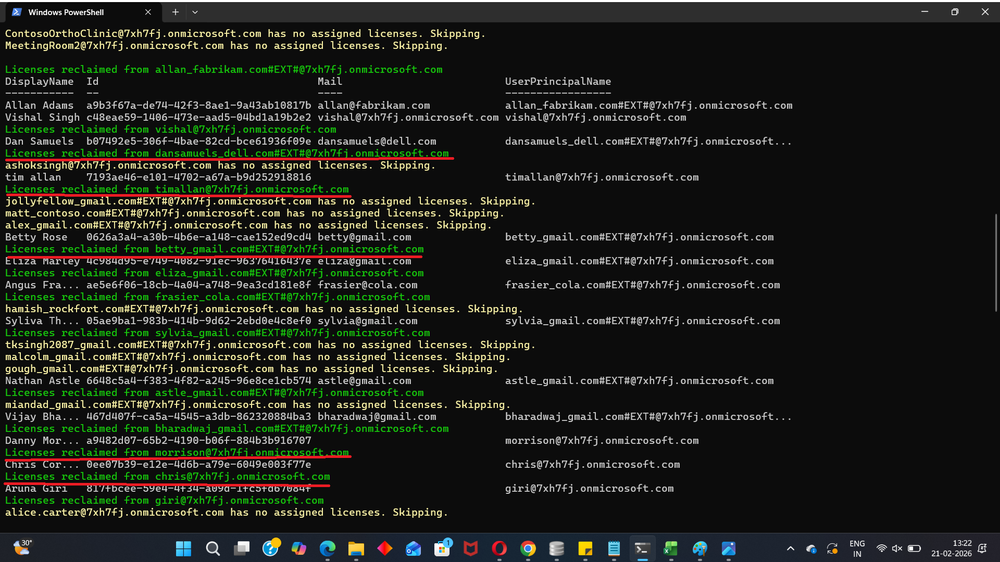

<html>

<h1>Remove Licenses from Disabled Users</h1>

This script helps administrators reclaim Microsoft 365 licenses from disabled user accounts using Microsoft Graph PowerShell.

<h2>📌 Overview</h2>

Disabled users may continue to consume Microsoft 365 licenses if licenses are not removed during offboarding or cleanup activities.

This script enables you to:

<ul>
<li>Identify disabled users</li>
<li>Check assigned licenses</li>
<li>Remove all licenses from disabled accounts</li>
<li>Generate a detailed cleanup report</li>
</ul>

<h2>🚀 Features</h2>

<ul>
<li>Fetches all disabled users</li>
<li>Checks assigned license SKUs</li>
<li>Skips users without licenses</li>
<li>Removes all assigned licenses from disabled users</li>
<li>Tracks success, skipped, and failed operations</li>
<li>Exports results to CSV</li>
</ul>

<h2>🛠 Prerequisites</h2>

<ul>
<li>Microsoft Graph PowerShell module</li>
<li>Required permissions:
    <ul>
        <li><code>User.ReadWrite.All</code></li>
        <li><code>Organization.Read.All</code></li>
    </ul>
</li>
</ul>

Connect using:

<pre>
Connect-MgGraph -Scopes "User.ReadWrite.All","Organization.Read.All"
</pre>

<h2>📂 Files Included</h2>

<ul>
<li><code>remove-licenses-from-disabled-users.ps1</code> — PowerShell script</li>
<li><code>README.md</code> — Script overview and usage notes</li>
<li><code>demo.png</code> — Sample output image</li>
</ul>

<h2>📊 Sample Output</h2>

Below is a sample output of the script execution:

<h2>🎯 Use Cases</h2>

<ul>
<li>Reclaim licenses from disabled users</li>
<li>Support offboarding cleanup</li>
<li>Reduce unnecessary license consumption</li>
<li>Improve license governance and cost control</li>
</ul>

<h2>⚠️ Important Considerations</h2>

<ul>
<li>This script removes all assigned licenses from disabled users</li>
<li>Validate business requirements before running in production</li>
<li>Test in a non-production environment or with a small user set first</li>
<li>Review the CSV report after execution</li>
</ul>

<h2>⚠️ Notes</h2>

<ul>
<li>Only users with <code>accountEnabled = false</code> are processed</li>
<li>Disabled users without licenses are skipped</li>
<li>License SKU IDs removed are included in the report</li>
<li>Errors are captured with the corresponding user details</li>
</ul>

🌐 Detailed Guide

For full script, explanation, and enhancements:

View Detailed Article on M365Corner👉 https://m365corner.com/m365-powershell/remove-licenses-from-disabled-users-graph-powershell.html

<h2>⭐ Support</h2>

If you find this useful:

<ul>
<li>Star ⭐ the repository</li>
<li>Share with fellow administrators</li>
</ul>

<h2>📌 About M365Corner</h2>

M365Corner provides practical Microsoft 365 PowerShell scripts and admin guides to simplify day-to-day operations.

👉 <a href="https://m365corner.com" target="_blank">https://m365corner.com</a>

</html>
