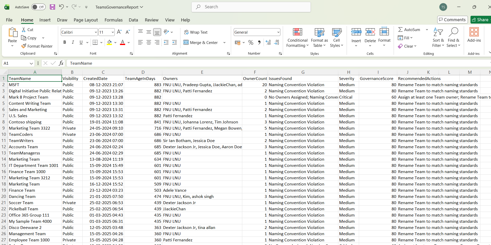

<html> <h1>Automate Microsoft Teams Governance Checks</h1> 
 This script helps administrators automate <b>Microsoft Teams governance checks</b> using Microsoft Graph PowerShell. 
 
 <h2>📌 Overview</h2> 
 Maintaining governance standards across Microsoft Teams environments can be challenging at scale. This script automates governance reviews and identifies Teams that violate organizational policies. 
 
This script enables you to:
 <ul> <li>Identify non-compliant Microsoft Teams</li> <li>Detect missing or weak Team descriptions</li> <li>Find Teams without owners</li> <li>Validate naming convention compliance</li> <li>Generate governance scores and recommendations</li> <li>Email governance reports automatically</li> </ul> 
 <h2>🚀 Features</h2> <ul> <li>Retrieves all Teams-enabled Microsoft 365 groups</li> <li>Performs multiple governance validations</li> <li>Calculates Team age before evaluation</li> <li>Identifies governance violations</li> <li>Assigns severity levels and governance scores</li> <li>Exports detailed CSV governance reports</li> <li>Sends automated HTML email reports</li> </ul> 
 <h2>🛠 Governance Checks Included</h2> <ul> <li>Missing Team descriptions</li> <li>Weak or placeholder descriptions</li> <li>Public Teams without descriptions</li> <li>Teams with no owners</li> <li>Naming convention violations</li> </ul> 
 <h2>🛠 Prerequisites</h2> <ul> <li>Microsoft Graph PowerShell module</li> <li>Required permissions: <ul> <li><code>Group.Read.All</code></li> <li><code>User.Read.All</code></li> <li><code>Mail.Send</code></li> </ul> </li> </ul> 
Connect using:
 <pre> Connect-MgGraph -Scopes "Group.Read.All","User.Read.All","Mail.Send" </pre> 
 <h2>📂 Files Included</h2> <ul> <li><code>automate-microsoft-teams-governance-checks.ps1</code> — PowerShell script</li> <li><code>README.md</code> — Script overview and usage notes</li> <li><code>demo.png</code> — Sample output image</li> </ul> 
 <h2>📊 Governance Report Details</h2> 
The generated report includes:
 <ul> <li>Team Name</li> <li>Visibility</li> <li>Team Age</li> <li>Owner Count</li> <li>Issues Found</li> <li>Severity Level</li> <li>Governance Score</li> <li>Recommended Actions</li> </ul> 
 <h2>📊 Sample Output</h2> 
Below is a sample output of the script execution:
  
<em>📌 The image above is sourced from the original M365Corner article.</em>
 
 <h2>🎯 Use Cases</h2> <ul> <li>Automate Microsoft Teams governance reviews</li> <li>Identify non-compliant Teams</li> <li>Improve collaboration governance posture</li> <li>Enforce naming and metadata standards</li> <li>Support audit and compliance initiatives</li> </ul> 
 <h2>🌐 Detailed Guide</h2> 
 For full script, explanation, and enhancements: 
 
 👉 <a href="https://m365corner.com/m365-powershell/automate-microsoft-teams-governance-checks-with-powershell.html" target="_blank"> View Detailed Article on M365Corner </a> 
 
 <h2>⚠️ Important Considerations</h2> <ul> <li>Update sender and recipient email addresses before execution</li> <li>Ensure export folder exists before running the script</li> <li>Adjust naming convention regex to match organizational standards</li> <li>Review governance scoring logic before production deployment</li> </ul> 
 <h2>⚠️ Notes</h2> <ul> <li>Newly created Teams are excluded based on minimum age threshold</li> <li>Governance score decreases based on number of issues detected</li> <li>Only non-compliant Teams are included in the report</li> <li>Email includes a preview of the first 10 non-compliant Teams</li> </ul> 
 <h2>⭐ Support</h2> 
If you find this useful:
 <ul> <li>Star ⭐ the repository</li> <li>Share with fellow administrators</li> </ul> 
 <h2>📌 About M365Corner</h2> 
 M365Corner provides practical Microsoft 365 PowerShell scripts and admin guides to simplify day-to-day operations. 
 
 👉 <a href="https://m365corner.com" target="_blank">https://m365corner.com</a> 
 </html>