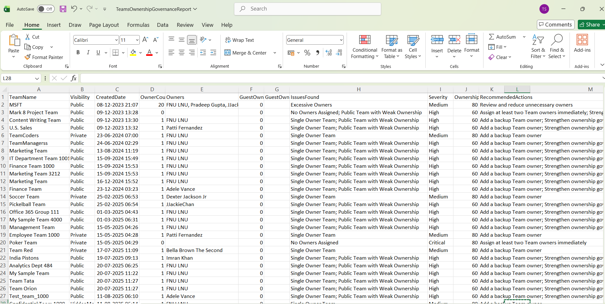

<html> <h1>Automate Microsoft Teams Ownership Governance</h1> 
 This script helps administrators automate <b>Microsoft Teams ownership governance reviews</b> using Microsoft Graph PowerShell. 
 
 <h2>📌 Overview</h2> 
 Weak ownership governance in Microsoft Teams can lead to unmanaged collaboration spaces, orphaned Teams, and security risks. This script automates ownership reviews and identifies Teams that violate ownership governance standards. 
 
This script enables you to:
 <ul> <li>Identify Teams with weak ownership governance</li> <li>Detect Teams without owners</li> <li>Find Teams with guest owners</li> <li>Identify Teams with excessive owners</li> <li>Generate ownership governance scores and recommendations</li> <li>Email governance reports automatically</li> </ul> 
 <h2>🚀 Features</h2> <ul> <li>Retrieves all Teams-enabled Microsoft 365 groups</li> <li>Evaluates Team ownership configuration</li> <li>Detects guest ownership assignments</li> <li>Calculates ownership health scores</li> <li>Assigns governance severity levels</li> <li>Exports detailed CSV governance reports</li> <li>Sends automated HTML email reports</li> </ul> 
 <h2>🛠 Ownership Governance Checks Included</h2> <ul> <li>No Team owners assigned</li> <li>Single-owner Teams</li> <li>Excessive Team owners</li> <li>Guest owners detected</li> <li>Public Teams with weak ownership</li> </ul> 
 <h2>🛠 Prerequisites</h2> <ul> <li>Microsoft Graph PowerShell module</li> <li>Required permissions: <ul> <li><code>Group.Read.All</code></li> <li><code>User.Read.All</code></li> <li><code>Directory.Read.All</code></li> <li><code>Mail.Send</code></li> </ul> </li> </ul> 
Connect using:
 <pre> Connect-MgGraph -Scopes "Group.Read.All","User.Read.All","Directory.Read.All","Mail.Send" </pre> 
 <h2>📂 Files Included</h2> <ul> <li><code>automate-microsoft-teams-ownership-governance.ps1</code> — PowerShell script</li> <li><code>README.md</code> — Script overview and usage notes</li> <li><code>demo.png</code> — Sample output image</li> </ul> 
 <h2>📊 Governance Report Details</h2> 
The generated report includes:
 <ul> <li>Team Name</li> <li>Visibility</li> <li>Created Date</li> <li>Owner Count</li> <li>Guest Owner Count</li> <li>Issues Found</li> <li>Severity Level</li> <li>Ownership Health Score</li> <li>Recommended Actions</li> </ul> 
 <h2>📊 Sample Output</h2> 
Below is a sample output of the script execution:
  
<em>📌 The image above is sourced from the original M365Corner article.</em>
 
 <h2>🎯 Use Cases</h2> <ul> <li>Automate Teams ownership governance reviews</li> <li>Identify orphaned or weakly managed Teams</li> <li>Review external ownership assignments</li> <li>Strengthen Teams governance posture</li> <li>Support audit and compliance initiatives</li> </ul> 
 <h2>🌐 Detailed Guide</h2> 
 For full script, explanation, and enhancements: 
 
 👉 <a href="https://m365corner.com/m365-powershell/automate-microsoft-teams-ownership-governance-with-powershell.html" target="\_blank"> View Detailed Article on M365Corner </a> 
 
 <h2>⚠️ Important Considerations</h2> <ul> <li>Update sender and recipient email addresses before execution</li> <li>Ensure export folder exists before running the script</li> <li>Guest owners should be reviewed carefully for security risks</li> <li>Teams with no owners should be remediated immediately</li> </ul> 
 <h2>⚠️ Notes</h2> <ul> <li>Only Teams with governance findings are included in the report</li> <li>Ownership health score decreases based on issue count</li> <li>Email includes a preview of the first 10 affected Teams</li> <li>Public Teams with weak ownership receive higher severity ratings</li> </ul> 
 <h2>⭐ Support</h2> 
If you find this useful:
 <ul> <li>Star ⭐ the repository</li> <li>Share with fellow administrators</li> </ul> 
 <h2>📌 About M365Corner</h2> 
 M365Corner provides practical Microsoft 365 PowerShell scripts and admin guides to simplify day-to-day operations. 
 
 👉 <a href="https://m365corner.com" target="\_blank">https://m365corner.com</a> 
 </html>

