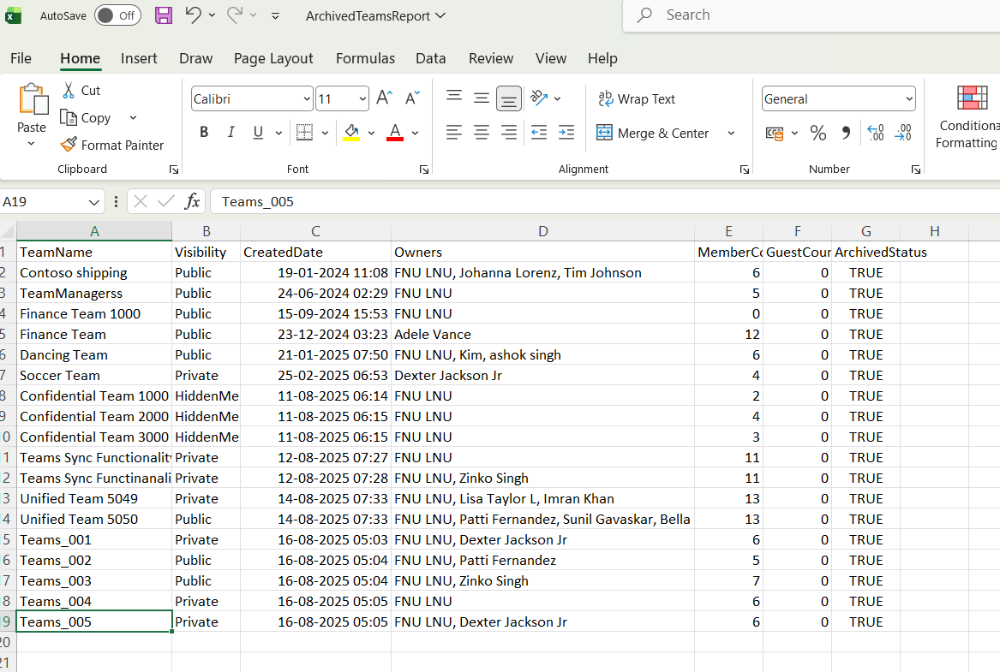

<html> <h1>Automate Archived Microsoft Teams Reporting</h1> 
 This script helps administrators automate reporting for <b>archived Microsoft Teams</b> using Microsoft Graph PowerShell. 
 
 <h2>📌 Overview</h2> 
 Archived Teams often remain in the environment long after active usage ends. Regular reporting helps administrators review ownership, membership, guest access, and governance posture of archived Teams. 
 
This script enables you to:
 <ul> <li>Identify archived Microsoft Teams</li> <li>Collect owner and membership information</li> <li>Track guest user presence</li> <li>Export governance reports to CSV</li> <li>Email reports automatically to administrators</li> </ul> 
 <h2>🚀 Features</h2> <ul> <li>Retrieves all Teams-enabled Microsoft 365 groups</li> <li>Filters only archived Teams</li> <li>Captures Team ownership details</li> <li>Counts members and guest users</li> <li>Exports report to CSV</li> <li>Sends automated HTML email with report attachment</li> <li>Includes preview of archived Teams in email body</li> </ul> 
 <h2>🛠 Prerequisites</h2> <ul> <li>Microsoft Graph PowerShell module</li> <li>Required permissions: <ul> <li><code>Group.Read.All</code></li> <li><code>User.Read.All</code></li> <li><code>Mail.Send</code></li> </ul> </li> </ul> 
Connect using:
 <pre> Connect-MgGraph -Scopes "Group.Read.All","User.Read.All","Mail.Send" </pre> 
 <h2>📂 Files Included</h2> <ul> <li><code>automate-archived-microsoft-teams-reporting.ps1</code> — PowerShell script</li> <li><code>README.md</code> — Script overview and usage notes</li> <li><code>demo.png</code> — Sample output image</li> </ul> 
 <h2>📊 Report Details</h2> 
The generated report includes:
 <ul> <li>Team Name</li> <li>Visibility</li> <li>Created Date</li> <li>Owner Names</li> <li>Member Count</li> <li>Guest User Count</li> <li>Archived Status</li> </ul> 
 <h2>📊 Sample Output</h2> 
Below is a sample output of the script execution:
  
<em>📌 The image above is sourced from the original M365Corner article.</em>
 
 <h2>🎯 Use Cases</h2> <ul> <li>Audit archived Teams across the tenant</li> <li>Review guest access in archived Teams</li> <li>Support Teams governance initiatives</li> <li>Automate periodic Teams reporting</li> <li>Improve visibility into inactive collaboration spaces</li> </ul> 
 <h2>🌐 Detailed Guide</h2> 
 For full script, explanation, and enhancements: 
 
 👉 <a href="https://m365corner.com/m365-powershell/automate-archived-microsoft-teams-reporting-with-powershell.html" target="_blank"> View Detailed Article on M365Corner </a> 
 
 <h2>⚠️ Important Considerations</h2> <ul> <li>Update sender and recipient email addresses before execution</li> <li>Ensure the export folder exists before running the script</li> <li>Email sending requires Mail.Send permission</li> <li>Large environments may take additional processing time</li> </ul> 
 <h2>⚠️ Notes</h2> <ul> <li>The script processes only Teams with archived status enabled</li> <li>Email includes a preview of the first 10 archived Teams</li> <li>Guest user counts help identify external collaboration exposure</li> <li>Useful for recurring governance and compliance reporting</li> </ul> 
 <h2>⭐ Support</h2> 
If you find this useful:
 <ul> <li>Star ⭐ the repository</li> <li>Share with fellow administrators</li> </ul> 
 <h2>📌 About M365Corner</h2> 
 M365Corner provides practical Microsoft 365 PowerShell scripts and admin guides to simplify day-to-day operations. 
 
 👉 <a href="https://m365corner.com" target="_blank">https://m365corner.com</a> 
 </html>