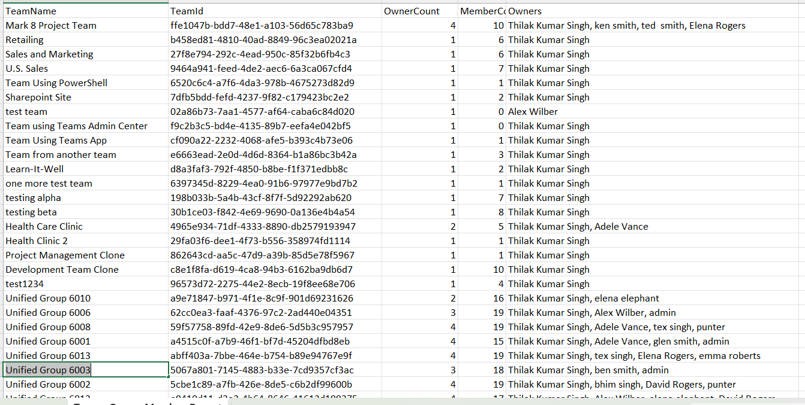

<html>

<h1>Find Team Member and Owner Counts</h1>

This script helps administrators retrieve Microsoft Teams along with their <b>owner count</b> and <b>member count</b> using Microsoft Graph PowerShell.

<h2>📌 Overview</h2>

Understanding the ownership and membership distribution of Teams is critical for governance, collaboration management, and security.

This script enables you to:

<ul>
<li>List all Microsoft Teams in the tenant</li>
<li>Count the number of owners per Team</li>
<li>Count the number of members per Team</li>
<li>Export detailed results for reporting</li>
</ul>

<h2>🚀 Features</h2>

<ul>
<li>Retrieves all Teams (Microsoft 365 Groups with Teams enabled)</li>
<li>Calculates owner and member counts for each Team</li>
<li>Displays owner names for quick reference</li>
<li>Exports results to CSV for analysis</li>
<li>Provides real-time console output during execution</li>
</ul>

<h2>🛠 Prerequisites</h2>

<ul>
<li>Microsoft Graph PowerShell module</li>
<li>Required permissions:
    <ul>
        <li><code>Group.Read.All</code></li>
        <li><code>Directory.Read.All</code></li>
    </ul>
</li>
</ul>

Connect using:

<pre>
Connect-MgGraph -Scopes "Group.Read.All","Directory.Read.All"
</pre>

<h2>📂 Files Included</h2>

<ul>
<li><code>find-team-member-and-owner-counts.ps1</code> — PowerShell script</li>
<li><code>README.md</code> — Script overview and usage notes</li>
<li><code>demo.png</code> — Sample output image</li>
</ul>

<h2>📊 Sample Output</h2>

Below is a sample output of the script execution:

<h2>🎯 Use Cases</h2>

<ul>
<li>Audit Team ownership distribution</li>
<li>Identify Teams with too few or too many owners</li>
<li>Monitor membership size across Teams</li>
<li>Support governance and reporting requirements</li>
</ul>

<h2>⚠️ Governance Insights</h2>

<ul>
<li>Teams should have at least <b>2 owners</b> to avoid dependency risks</li>
<li>Very large Teams may require additional governance controls</li>
<li>Ownership imbalance can indicate governance gaps</li>
</ul>

<h2>⚠️ Notes</h2>

<ul>
<li>The script filters only Teams-enabled groups</li>
<li>Owner names are retrieved from directory properties</li>
<li>Export path should be updated based on your environment</li>
</ul>

🌐 Detailed Guide
For full script, explanation, and enhancements:
View Detailed Article on M365Corner👉 https://m365corner.com/m365-powershell/find-teams-member-and-owner-counts.html

<h2>⭐ Support</h2>

If you find this useful:

<ul>
<li>Star ⭐ the repository</li>
<li>Share with fellow administrators</li>
</ul>

<h2>📌 About M365Corner</h2>

M365Corner provides practical Microsoft 365 PowerShell scripts and admin guides to simplify day-to-day operations.

👉 <a href="https://m365corner.com" target="_blank">https://m365corner.com</a>

</html>
