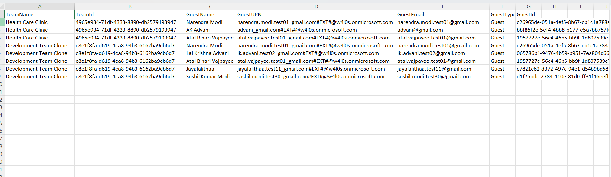

<html>

<h1>Find Teams with External Users</h1>

This script helps administrators identify Microsoft Teams that contain <b>external guest users</b> using Microsoft Graph PowerShell.

<h2>📌 Overview</h2>

External users in Teams can introduce collaboration, security, and governance risks if not reviewed regularly.

This script enables you to:

<ul>
<li>Fetch all Microsoft Teams in the tenant</li>
<li>Identify Teams that contain guest users</li>
<li>Export guest user details for review</li>
<li>Support external access governance</li>
</ul>

<h2>🚀 Features</h2>

<ul>
<li>Retrieves all Teams-enabled Microsoft 365 groups</li>
<li>Fetches Team members as user objects</li>
<li>Filters members where <code>UserType</code> is <code>Guest</code></li>
<li>Exports Team and guest user details to CSV</li>
<li>Displays Teams with guest users in console output</li>
</ul>

<h2>🛠 Prerequisites</h2>

<ul>
<li>Microsoft Graph PowerShell module</li>
<li>Required permission:
    <ul>
        <li><code>Directory.Read.All</code></li>
    </ul>
</li>
</ul>

Connect using:

<pre>
Connect-MgGraph -Scopes "Directory.Read.All"
</pre>

<h2>📂 Files Included</h2>

<ul>
<li><code>find-teams-with-external-users.ps1</code> — PowerShell script</li>
<li><code>README.md</code> — Script overview and usage notes</li>
<li><code>demo.png</code> — Sample output image</li>
</ul>

<h2>📊 Sample Output</h2>

Below is a sample output of the script execution:

<em>📌 The image above is sourced from the original M365Corner article.</em>

<h2>🎯 Use Cases</h2>

<ul>
<li>Audit Teams with external guest access</li>
<li>Review guest user presence across Teams</li>
<li>Strengthen Teams governance</li>
<li>Support external collaboration reviews</li>
<li>Identify Teams that may require tighter access controls</li>
</ul>

<h2>🌐 Detailed Guide</h2>

For full script, explanation, and enhancements:

👉 https://m365corner.com/m365-powershell/find-teams-with-external-users-using-powershell.html

<h2>⚠️ Notes</h2>

<ul>
<li>The script checks Teams-enabled Microsoft 365 groups</li>
<li>Only members with <code>UserType = Guest</code> are included</li>
<li>If no guest users are found, no CSV report is generated</li>
<li>Review guest access regularly as part of Teams governance</li>
</ul>

<h2>⭐ Support</h2>

If you find this useful:

<ul>
<li>Star ⭐ the repository</li>
<li>Share with fellow administrators</li>
</ul>

<h2>📌 About M365Corner</h2>

M365Corner provides practical Microsoft 365 PowerShell scripts and admin guides to simplify day-to-day operations.

👉 <a href="https://m365corner.com" target="_blank">https://m365corner.com</a>

</html>
